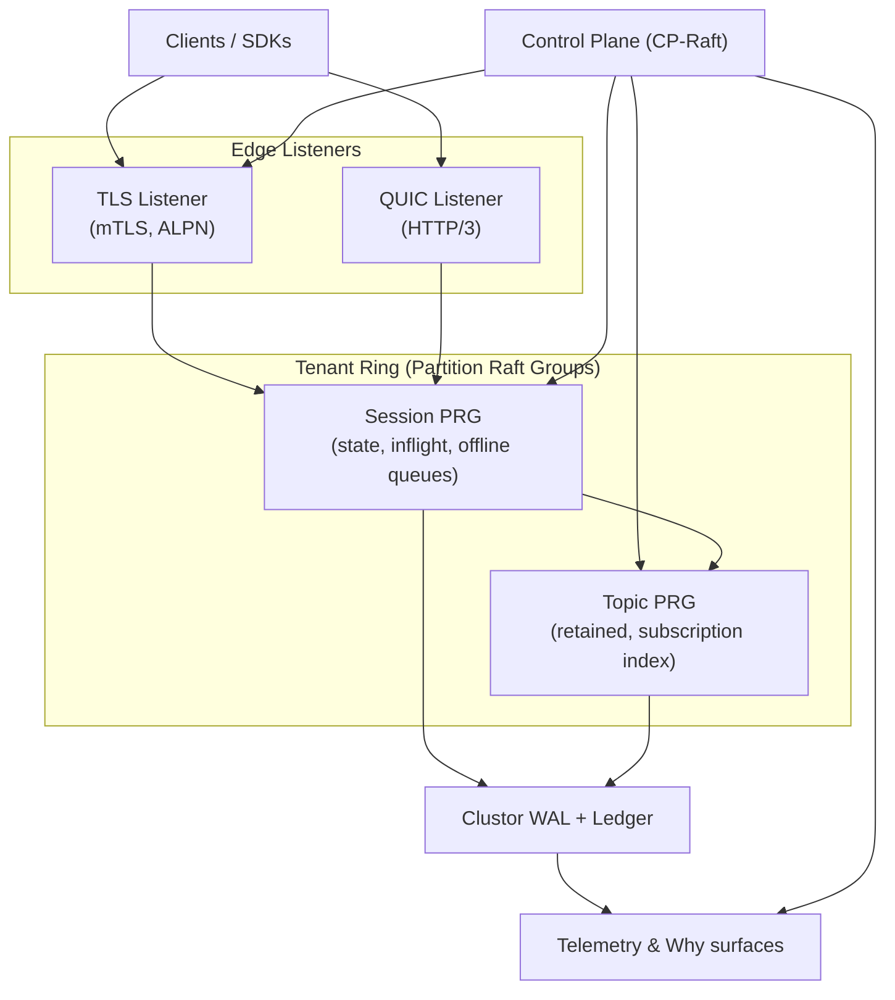
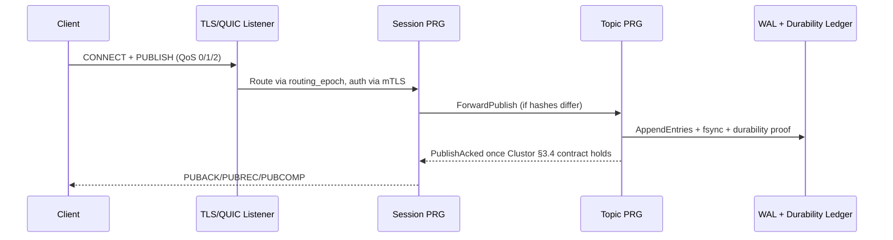

# Quantum – Raft-Backed Multi-Tenant MQTT Fabric

Quantum is a single-binary MQTT broker that layers MQTT 3.1/3.1.1/5.0 semantics on top of Clustor’s normative Raft substrate. Each tenant receives isolated Partition Raft Groups (PRGs) for sessions and topics, embedded ControlPlaneRaft handles routing/quotas/certificates, and listeners expose TLS and QUIC entry points with deterministic backpressure. The entire stack prioritizes strict durability (ack after quorum fsync), explainable throttling, and observability that mirrors the Clustor guardrails it inherits.

---

## Why Quantum
- **Exactly-once QoS inside the broker** – Sessions, dedupe tables, and offline queues live in Clustor WAL/snapshots so PUBACK/PUBREL contracts persist through restarts, drains, and leader moves.
- **Multi-tenant isolation** – Each tenant owns a ring of PRGs, routing epochs are fenced by ControlPlaneRaft, and quotas/certificates/ACLs live in the CP manifest rather than per-node cache files.
- **Transport flexibility** – TLS/TCP listeners and QUIC listeners share the same mTLS policy, SNI/ALPN routing, and per-tenant auth, so clients can migrate between transports without touching broker-side policy.
- **Operational determinism** – Embedded CP ensures `/readyz` only flips green once CP cache freshness, PRG replay, and strict-fallback checks all pass; drain tooling plus leader transfer hooks keep rolling updates predictable.
- **Tooling-first workflows** – Fixture seeding, CLI publish/subscribe tooling, and spec-lint wiring keep developers and CI on the same deterministic artifacts that production deployments rely on.

---

## Architecture Overview



- **Edge listeners** terminate TLS 1.3 + QUIC with mTLS, enforce per-tenant routing via SNI/ALPN, and hand off CONNECTs to session PRGs.
- **Session PRGs** own MQTT session state, inflight maps, dedupe tables, and offline queues. They forward publishes to the owning topic PRG when hashes do not align.
- **Topic PRGs** enforce per-topic ordering, retained stores, subscription indexes, and batch delivery toward session PRGs.
- **ControlPlaneRaft** governs tenant metadata, routing epochs, feature gates, and placement; the embedded mode runs in-process and shares the telemetry/export surfaces.
- **Storage** relies exclusively on Clustor WAL segments, durability ledgers, and signed snapshots; there is no alternate persistence path.

---

## Publish & QoS Flow



- ACKs never bypass Clustor’s quorum-fsync proof (`durability_mode = "strict"` by default). Group-fsync is supported for relaxed durability, but loses the no-ACK-loss guarantee.
- Session replays, dedupe tables, and offline queues use Clustor checkpoints so reconnects reproduce the exact inflight state before readiness flips.
- Cross-PRG forwards carry `forward_seq` tokens scoped by routing epoch so rebalances remain idempotent.

---

## Control Plane & Partitioning
- `control_plane.mode = "embedded"` is the sole supported mode (`docs/embedded_control_plane.md`). CP HTTP (`127.0.0.1:19000`) and Raft (`127.0.0.1:19001`) bindings can be widened when experimenting with multi-node quorums.
- Tenants specify `tenant_prg_count`; session and topic hashes use the same ring. Rebalances bump epochs, fence sessions via `session_epoch++`, and stream checkpoints before redirects.
- Bootstrap helpers (`control_plane.bootstrap_tenants` and `bootstrap_placements`) seed embedded deployments; otherwise a `local` tenant with one placement is created automatically.
- Placement, leader transfer, and rebalance automation inherit Clustor’s guardrails; read gates and strict-fallback must evaluate before any cached metadata is trusted.

---

## Listener & Transport Surface
- TCP listener defaults to `0.0.0.0:8883` with ALPN `mqtt`; QUIC listener defaults to `0.0.0.0:1884` with `mqtt-quic` ALPN (`config/quantum.toml`).
- Each listener requires a TLS chain/key pair plus the CA used to verify clients. Embedded CP can reuse the same bundle to keep dev setups simple.
- Listeners expose readiness, drain, and strict-fallback state under `/metrics` so L4 load balancers can evict nodes that fail CP freshness or hit durability fences (`docs/high_availability.md`).
- The optional forward plane (`forward_plane.*` config) allows PRGs to fan out MQTT payloads into HTTP workloads for deterministic fan-out testing.

---

## Telemetry, CLI, and Tooling
- `/metrics` exports Clustor health, MQTT flow-control (`quantum_flow_credit_*`), CP cache freshness, replication lag, and audit counters. `/why` surfaces structured fault reasons for on-call correlations.
- `docs/runbook_scaling.md`, `docs/performance.md`, and `docs/deployment.md` capture automation hooks for tenant scale-up, PRG rebalance, and sizing guidance.
- The CLI (`docs/cli.md`) mirrors kcat ergonomics:
  - `quantum subscribe` streams MQTT topics with automatic reconnects and JSON/RAW output.
  - `quantum publish` pushes single-topic or multi-topic batches with QoS 0/1/2 and retain support.
  - Supporting commands (`quantum init`, `inspect`, `snapshot`, `telemetry`, `chaos`, `synthetic`) wrap fixture seeding, WAL inspection, and probe workflows.
- TLS everywhere: CLI subcommands require `--cert/--key/--ca`; the broker enforces mTLS even for diagnostics so identical auth flows exist across tooling and production traffic.

---

## Configuration & Bootstrapping

`config/quantum.toml` documents the default single-node embedded profile:

```toml
[control_plane]
mode = "embedded"
embedded_http_bind = "127.0.0.1:19000"
embedded_raft_bind = "127.0.0.1:19001"

[listeners.tcp]
bind = "0.0.0.0:8883"
tls_chain_path = "certs/server.pem"
tls_key_path = "certs/server.key"
client_ca_path = "certs/ca.pem"

[listeners.quic]
bind = "0.0.0.0:1884"
alpn = ["mqtt-quic"]

[durability]
durability_mode = "strict"
quorum_size = 1
replica_id = "local"

[paths]
storage_dir = "data"
```

1. Generate or supply TLS assets for listeners and, optionally, a dedicated CP bundle.
2. Seed tenants/placements (`control_plane.bootstrap_*`) or rely on the default `local` tenant.
3. Start the broker via `cargo run --bin quantum -- --config config/quantum.toml` (or `quantum start`) and override binds via CLI flags when required (`quantum --cp-http-bind ...`).
4. Expose `/metrics` to your Prometheus/OTel collectors and configure L4 health checks to respect `/readyz` plus the drain flag documented in `docs/high_availability.md`.

---

## Fixture Seeding & Dev Loop
- Deterministic fixtures under `data/fixtures/mqtt` describe tenants, PRG snapshots, and WAL seeds (`docs/dev_seeding.md`).
- `make dev-seed` (or `quantum init`) hydrates `data/` with those fixtures, populates the CP capability registry, and emits `data/seed_report.json` with digests CI can assert.
- Set `TENANT=<name>` before running `make dev-seed` to restrict seeding to a single tenant, or pass `--dry-run` to preview writes.
- Use the seeded data to run CLI scenarios end-to-end against a local broker without manual provisioning.

---

## Build, Tests, and Spec Sync
- `make build`, `make build-release`, and `make check` wrap the usual Cargo workflows with `--all-features` enabled.
- `make test` runs the full workspace suite; `make interop` targets the ignored interop harness for cross-version MQTT checks.
- `make dev-seed` and the fixture-focused tests keep WAL and snapshot digests aligned with the spec.
- Run `make spec-lint` whenever Clustor manifests or MQTT wire catalogs change; the target ensures `../clustor/target/release/spec_lint` is regenerated before linting.
- `make wire-lint` currently stubs out wire-definition enforcement; keep it on your radar as MQTT surfaces expand.

---

## Repository Layout

| Directory | Type | Description |
|-----------|------|-------------|
| `src/` | Rust crate | Main library and binary source. Contains the `quantum` crate with modules for control plane, networking, PRG management, MQTT workloads, replication, storage, and CLI. |
| `tests/` | Integration tests | Rust integration tests executed via `cargo test`. Tests exercise the public API and broker behavior. |
| `examples/` | Examples | Example client code and quickstart documentation. The `client/` subdirectory contains a standalone Cargo project. |
| `config/` | Assets | Example configuration files. `quantum.toml` is the reference single-node profile. |
| `docs/` | Documentation | Markdown documentation including specification, runbooks, CLI reference, and operational guides. |
| `tools/` | Utilities | Development and CI utilities: |
| | | - `telemetry_guard/` – Rust crate that validates telemetry catalog JSON structure |
| | | - `wire_lint/` – Rust crate that compares wire catalogs against Clustor artifacts |
| | | - `seed_workload_data/` – Standalone Rust binary for hydrating fixture data |
| `telemetry/` | Assets | Telemetry catalog (`catalog.json`) defining metrics, traces, and logs emitted by the broker. Not a Rust crate. |
| `wire/` | Assets | Wire protocol definitions (`mqtt.json`, `quic.json`) for protocol validation. Not a Rust crate. |
| `certs/` | Assets | TLS certificates and keys for development. Not committed to version control in production. |
| `data/` | Runtime | Runtime data directory containing WAL segments, snapshots, and fixtures. Ignored by git except for fixture seeds. |

The repository is a Cargo workspace. The main `quantum` crate produces the broker binary, while `tools/telemetry_guard/` and `tools/wire_lint/` are workspace members used for CI validation.

---

## Runbooks & Documentation
- **Specification** – `docs/specification.md` is the normative authority for partitioning, QoS guarantees, routing epochs, and MQTT/Clustor invariants. Treat it as law; README text only summarizes intent.
- **Deployment & HA** – `docs/deployment.md` and `docs/high_availability.md` document front-door patterns, readiness expectations, drain orchestration, and rolling restart guidance.
- **Scaling & Performance** – `docs/runbook_scaling.md` and `docs/performance.md` map tenant PRG counts, rebalance workflows, and throughput targets to metrics/alerts.
- **Interop & Operations** – `docs/interop.md` captures compatibility matrices with MQTT client stacks, while `docs/cli.md` and `docs/dev_seeding.md` keep developer flows deterministic.

Quantum inherits Clustor's guardrails for consensus, durability, telemetry, and manifest management. Keep spec and manifest hashes in lockstep, wire readiness into your load balancers, and lean on the documented tooling so CI, dev, and production environments all exercise the same deterministic surfaces.
