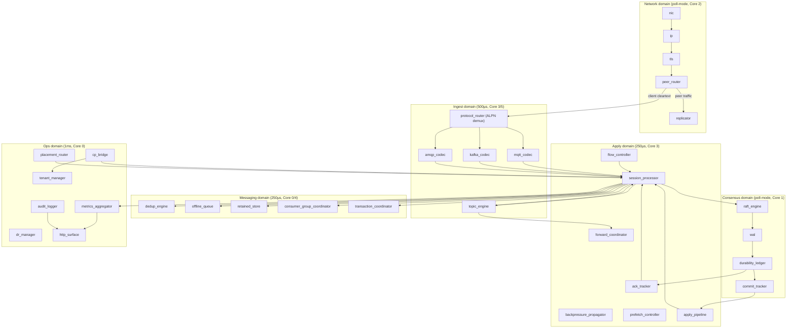

# Quantum — Fluxor-Native Multi-Protocol Message Broker

Quantum is a multi-protocol message broker (MQTT 3.1/3.1.1/5.0, Kafka, AMQP 0-9-1) built as a graph of cooperative modules on the [Fluxor](../fluxor) runtime, layered on top of the [Clustor](../clustor) Raft substrate. There is no monolithic Rust binary: the runtime is `fluxor-linux` (or the bare-metal equivalent), and every operational concern — codecs, session state, dedupe, retained store, forward coordination, control-plane enforcement, audit, metrics — is a position-independent `.fmod` module loaded by that runtime.

42 modules across 6 execution domains: 23 Clustor substrate modules (consensus, persistence, network, control plane), 4 Fluxor foundation modules (`nic`, `ip`, `tls`, `test_fault`), and **19 Quantum application modules**. The full architecture, module-by-module rationale, and graph definition live in [docs/native_fluxor.md](docs/native_fluxor.md).

---

## Why Quantum

- **Exactly-once QoS inside the broker** — Session records, dedupe tables, offline queues, retained payloads, consumer groups, and transaction state are committed through Clustor's WAL → fsync → quorum proof pipeline. PUBACK / PUBREC / PUBREL / PUBCOMP, Kafka `ProduceResponse`, and AMQP `Basic.Ack` are gated on durability proofs, not on local apply.
- **Multi-tenant isolation** — Each tenant owns a ring of PRGs (Partition Raft Groups); routing is fenced by CP-Raft epochs; per-tenant quotas, ACLs, and certificates live in the CP manifest. `tenant_manager` enforces token-bucket quotas with noisy-neighbour disconnect.
- **Multi-protocol on one substrate** — `protocol_router` ALPN-demuxes inbound traffic into per-protocol codecs (`mqtt_codec`, `kafka_codec`, `amqp_codec`) that all funnel into a unified `session_processor` and `topic_engine`. The same Raft pipeline serves all three.
- **Deterministic backpressure** — `flow_controller` runs a PID loop on replicator lag for proposal admission; `prefetch_controller` runs per-session consumer credits; `backpressure_propagator` translates substrate envelopes into protocol-native signals (MQTT `0x97`, Kafka `THROTTLING_QUOTA_EXCEEDED`, AMQP `drain=true`).
- **Operational determinism** — `http_surface` exposes `/readyz`, `/why`, `/metrics`, `/raft`, `/admin`. `dr_manager` orchestrates checkpoint export and fenced promotion; `audit_logger` emits Ed25519-signed compliance events; `metrics_aggregator` handles high-cardinality per-(tenant, protocol, prg) rollups.
- **Composable, not monolithic** — Every module has a fixed step function, explicit input/output ports, a bounded state arena, and a manifest declaring its scheduling tier. The graph is a YAML file. Modules can be swapped, the graph can be reshaped per deployment, and the runtime enforces the contract.

---

## Architecture Overview


```mermaid
graph TD
    subgraph Network["Network domain (poll-mode, Core 2)"]
        NIC["nic"]
        IP["ip"]
        TLS["tls"]
        Peer["peer_router"]
        Repl["replicator"]
    end
    subgraph Ingest["Ingest domain (500µs, Core 3/5)"]
        Router["protocol_router (ALPN demux)"]
        MQTT["mqtt_codec"]
        Kafka["kafka_codec"]
        AMQP["amqp_codec"]
        Topic["topic_engine"]
    end
    subgraph Apply["Apply domain (250µs, Core 3)"]
        Session["session_processor"]
        Ack["ack_tracker"]
        BP["backpressure_propagator"]
        Pre["prefetch_controller"]
        Fwd["forward_coordinator"]
        ApplyP["apply_pipeline"]
        Flow["flow_controller"]
    end
    subgraph Consensus["Consensus domain (poll-mode, Core 1)"]
        Raft["raft_engine"]
        WAL["wal"]
        Dur["durability_ledger"]
        Commit["commit_tracker"]
    end
    subgraph Messaging["Messaging domain (250µs, Core 0/4)"]
        Dedup["dedup_engine"]
        Offline["offline_queue"]
        Retained["retained_store"]
        Groups["consumer_group_coordinator"]
        Txn["transaction_coordinator"]
    end
    subgraph Ops["Ops domain (1ms, Core 0)"]
        CP["cp_bridge"]
        Place["placement_router"]
        Tenant["tenant_manager"]
        DR["dr_manager"]
        Audit["audit_logger"]
        Metrics["metrics_aggregator"]
        HTTP["http_surface"]
    end

    NIC --> IP --> TLS --> Peer
    Peer -->|client cleartext| Router
    Peer -->|peer traffic| Repl
    Router --> MQTT
    Router --> Kafka
    Router --> AMQP
    MQTT --> Session
    Kafka --> Session
    AMQP --> Session
    Session --> Topic
    Topic --> Fwd
    Topic --> Session
    Session --> Dedup
    Session --> Offline
    Session --> Retained
    Session --> Groups
    Session --> Txn
    Session --> Raft
    Raft --> WAL --> Dur --> Commit --> ApplyP --> Session
    Dur --> Ack
    Ack --> Session
    Flow --> Session
    CP --> Tenant
    CP --> Session
    Place --> Session
    Session --> Metrics --> HTTP
    Audit --> HTTP
```

- **Edge** terminates TLS 1.3 (mTLS, SNI/ALPN) and ALPN-demuxes into protocol codecs.
- **Session processor** unifies CONNECT lifecycle, epoch fencing, dedupe lookup, QoS state machines, and proposal emission across all three protocols.
- **Topic engine** handles subscription matching (MQTT wildcards, Kafka partitions, AMQP bindings), shared-subscription distribution, and cross-PRG forward emission with `forward_seq` idempotence.
- **Consensus** is Clustor's stock pipeline: Raft batching → WAL (per-entry or group fsync controlled by `wal`'s `fsync_mode` param) → durability ledger quorum → commit tracker → apply pipeline. Quantum's `session_processor` is the apply callback.
- **Ops** modules run on the cooperative core: CP polling, tenant policy enforcement, DR orchestration, audit signing, dimensional metric rollup, HTTP surface.

The full module reference, alignment rationale, and YAML graph live in [docs/native_fluxor.md](docs/native_fluxor.md).

---

## Setup

Quantum depends on `fluxor` and `clustor`. Both resolve through
the local Fluxor registry under `~/.fluxor/registry/` (the contract
is captured in `standards/dependencies.md`); for active cross-repo
iteration, list the colocated checkouts in
`~/.fluxor/workspace.toml` and the CLI reads them in place.

First-time setup on a fresh machine:

```sh
# 1. Clone the three repos as siblings.
cd ~/Development/nanocloudio
git clone git@github.com:nanocloudio/fluxor.git
git clone git@github.com:nanocloudio/clustor.git
git clone git@github.com:nanocloudio/quantum.git

# 2. Install the fluxor CLI from fluxor's tools crate (once per machine).
cd quantum && cargo install --locked --path ../fluxor/tools

# 3. Bootstrap the local registry + cargo registry alias.
fluxor registry init
fluxor registry setup-cargo

# 4. Either: publish from fluxor + clustor into the registry
#    (canonical mode) — see fluxor/docs/guides/publishing.md and
#    clustor/docs/consuming_fluxor.md — or set up live workspace
#    mode for cross-repo iteration:
cat > ~/.fluxor/workspace.toml <<'EOF'
[workspace]
members = [
  "/home/<you>/Development/nanocloudio/fluxor",
  "/home/<you>/Development/nanocloudio/clustor",
  "/home/<you>/Development/nanocloudio/quantum",
]
EOF
```

`fluxor workspace status` from inside any checkout reports the
active mode and the resolved member set.

### Resolving and syncing dependencies

```sh
fluxor update             # resolve fluxor.lock against the registry
fluxor sync               # install lockfile-resolved fmods + runtime into target/
```

`fluxor.lock` is committed. In live workspace mode the lockfile is
bypassed for workspace members and live sources are read directly;
an advisory prints once per `sync` invocation.

### Bumping the fluxor or clustor pin

```sh
# After upstream publishes a new version:
cd ../fluxor && make publish
cd ../quantum
fluxor update             # rewrites fluxor.lock with the new versions
fluxor sync               # re-materialises lockfile-resolved artefacts
git add fluxor.lock
git commit -m "Bump fluxor / clustor"
```

## Build

```sh
fluxor modules build --target bcm2712 --out target
```

`--target cm5` and `--target bcm2712` are the supported
aarch64-unknown-none targets (`--all` builds both). Compiled
artefacts land in `target/fluxor/<TARGET>/modules/*.fmod`.

The Makefile is the lifecycle only (`make help` lists it); everything
else is the `fluxor` CLI or a script invoked directly:

| Command | Purpose |
|---|---|
| `fluxor modules build --target … --out target` | Build Quantum's 19 `.fmod` artifacts |
| `fluxor modules build --all --out target` | Build for every supported target (cm5 + bcm2712) |
| `fluxor modules clean` | Remove built `.fmod` / `.elf` / `.o` |
| `tests/integration/module_graph_mqtt.sh` | E2E: spin up the graph, run MQTT/AMQP/Kafka smoke against it |
| `tests/integration/module_graph_load.sh` | Sustained-load + backpressure E2E |
| `fluxor validate configs/quantum-*.yaml` | Validate the shipped graph YAMLs against current module manifests |
| `tools/spec-lint.sh` | Run clustor spec lint against consensus core manifest |

---

## Run

Graph configs live under [configs/](configs/):

| Config | Topology |
|---|---|
| `quantum-linux-minimal.yaml` | 24-module MQTT-only single-node graph (smallest smoke target) |
| `quantum-linux.yaml` | Full 42-module single-node graph |
| `quantum-linux-2p.yaml` | 2-partition WAL test config |
| `quantum-node0.yaml` / `node1.yaml` / `node2.yaml` | 3-node Raft cluster |
| `quantum-cm5.yaml` | Production CM5 4-core layout |

Launch the runtime:

```sh
fluxor run configs/quantum-linux-minimal.yaml
```

`fluxor run` validates the YAML against the target's constraints, generates `target/linux/<config-name>/{config.bin, modules.bin}` (graph wiring + packed `.fmod` table), and exec's `fluxor-linux` against them. The default MQTT listener binds `127.0.0.1:9090` on the minimal graph; production graphs bind the listener configured in the YAML.

---

## Smoke & Chaos

```sh
# Single-node end-to-end smoke (modules load, Raft elects, MQTT CONNECT → CONNACK)
./tests/integration/runtime_smoke.sh

# Multi-protocol E2E against the running graph (build modules first:
# `fluxor modules build --target bcm2712 --out target`)
./tests/integration/module_graph_mqtt.sh

# QoS-1 load with PUBACK assertion
./tests/integration/module_graph_load.sh

# 3-node Raft cluster smoke
./tests/integration/multi_node.sh

# Standalone py drivers
./tests/integration/pubsub_test.py
./tests/integration/qos1_test.py
./tests/integration/wal_durability_test.py

# Chaos drivers (require a running graph)
./ops/scripts/chaos.sh connect-storm N=500
./ops/scripts/chaos.sh publish-burst N=10000 M=20
./ops/scripts/chaos.sh slow-publisher N=100 K=200
```

---

## Production Deployment

Install to `/opt/quantum` with the bundled systemd unit:

```sh
sudo ./ops/scripts/install.sh
sudo systemctl enable --now quantum
journalctl -u quantum -f
```

Layout after install:

```
/opt/quantum/
  bin/fluxor              # toolchain
  bin/fluxor-linux        # runtime
  modules/*.fmod          # Quantum + Clustor + foundation artifacts
/etc/quantum/*.yaml       # graph configs
/var/lib/quantum/         # WAL, snapshots, runtime state
/var/log/quantum/         # logs (also goes to journal)
```

Switch graph configs via systemd override:

```sh
sudo systemctl edit quantum
```

```ini
[Service]
Environment=QUANTUM_CONFIG=/etc/quantum/quantum-cm5.yaml
```

See [docs/guides/deployment.md](docs/guides/deployment.md) for the full deployment guide and [docs/guides/high_availability.md](docs/guides/high_availability.md) for rolling-restart and load-balancer integration.

---

## Repository Layout

| Path | Type | Description |
|---|---|---|
| `modules/` | Module source | 19 Quantum `.fmod` source trees (one per module, each with `mod.rs` + optional `manifest.toml`) plus `modules/common/` (helpers shared across modules and exposed as the `quantum-common` crate via the `crates/quantum-common/common` symlink) |
| `crates/quantum-common/` | Cargo crate | Host-consumable façade over `modules/common/*.rs`, depended on by downstream consumers of quantum |
| `configs/` | Graph YAML | Fluxor graph definitions for every supported deployment topology |
| `fluxor.toml` + `fluxor.lock` | Project manifest + lockfile | `[project]`, `[dependencies] fluxor / clustor`, `[ci]`, `[required]`. Lockfile records the SHA-256-hashed resolution against the local registry. |
| `.fluxor-rig.toml` | Rig build recipe | `[build.cm5]` orchestrates firmware + module + kernel-image construction for `fluxor rig test` against `tests/hardware/` scenarios |
| `ops/scripts/` | Operator tooling | `install.sh` (systemd install), `chaos.sh` (fault injection) |
| `ops/systemd/` | Unit files | `quantum.service` |
| `tests/integration/` | E2E drivers | Bash + stdlib-Python scripts: smoke, multi-node, pubsub, QoS-1, WAL durability, load, multi-protocol |
| `tests/hardware/` | Rig scenarios | `fluxor rig test` configs (e.g. `quantum_cm5_boot.toml`) |
| `docs/` | Documentation | Architecture spec, deployment, HA, runbooks, CLI, interop |
| `wire/` | Wire schemas | `mqtt.json`, `amqp.json`, `kafka.json`, `catalog.json` |
| `telemetry/` | Assets | Telemetry catalog |
| `certs/` | Dev TLS | Development certificate material (do not ship in production) |
| `data/` | Runtime | WAL segments, snapshots, CP storage (gitignored except for seed material) |

A Cargo workspace at the repo root carries the lint baseline and the host-side toolchain crates under `tools/` plus `crates/quantum-common/`. Each module under `modules/app/` builds as a standalone PIC object and is packed into a `.fmod` artefact by `fluxor modules build`.

---

## Documentation Map

Start here:

- **[docs/overview.md](docs/overview.md)** — entry point into the documentation set with conventions and pointers.
- **[docs/native_fluxor.md](docs/native_fluxor.md)** — module alignment analysis (why 42 modules) plus the complete YAML graph and wiring.

Architecture (normative — what the modules contract to do):

- [Messaging Model](docs/architecture/messaging_model.md), [Partitioning & Routing](docs/architecture/partitioning.md)
- [MQTT Adapter](docs/architecture/mqtt_adapter.md), [Kafka Adapter](docs/architecture/kafka_adapter.md), [AMQP Adapter](docs/architecture/amqp_adapter.md)
- [Control Plane](docs/architecture/control_plane.md), [Multi-Tenancy](docs/architecture/multi_tenancy.md), [Flow Control](docs/architecture/flow_control.md)
- [Security](docs/architecture/security.md), [Observability](docs/architecture/observability.md), [Disaster Recovery](docs/architecture/disaster_recovery.md)

Guides (operational — how to drive the system):

- [Deployment](docs/guides/deployment.md), [High Availability](docs/guides/high_availability.md), [Scaling](docs/guides/scaling.md)
- [Performance](docs/guides/performance.md), [Interop](docs/guides/interop.md)
- [CLI Surface](docs/guides/cli.md), [Dependencies](docs/guides/dependencies.md), [Dev Seeding](docs/guides/dev_seeding.md)

Quantum inherits Clustor's guardrails for consensus, durability, telemetry, and manifest management; treat Clustor's [substrate_sharing.md](../clustor/docs/substrate_sharing.md) as the authoritative source for substrate-module behaviour.
