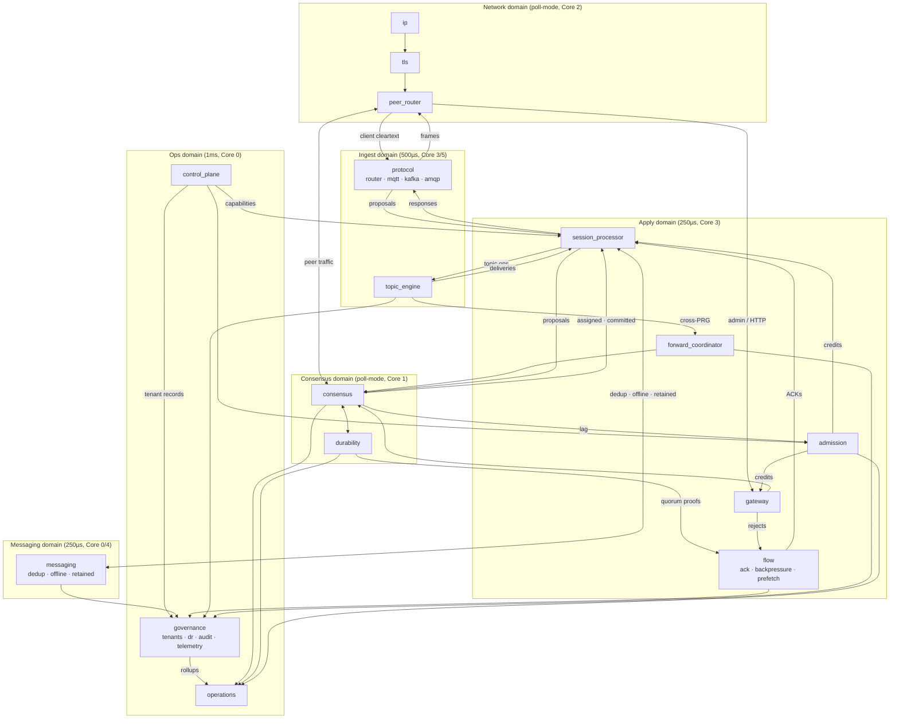

# Quantum — Fluxor-Native Multi-Protocol Message Broker

Quantum is a multi-protocol message broker (MQTT 3.1/3.1.1/5.0, Kafka, AMQP 0-9-1) built as a graph of cooperative modules on the [Fluxor](../fluxor) runtime, layered on top of the [Clustor](../clustor) Raft substrate. There is no monolithic Rust binary: the runtime is `fluxor-linux` (or the bare-metal equivalent), and every operational concern — codecs, session state, dedupe, retained store, forward coordination, control-plane enforcement, audit, metrics — is a position-independent `.fmod` module loaded by that runtime.

14 modules across 6 execution domains: 7 Clustor substrate modules (`peer_router`, `consensus`, `durability`, `gateway`, `admission`, `control_plane`, `operations`) and **7 Quantum application modules**. Bare-metal deployments add the Fluxor `tls` foundation module for a 15-module graph. `mqtt_quic_adapter` joins them for QUIC ingress. `modules/app/` holds five further modules that no broker graph wires in: the outbound protocol clients (`kafka_client`, `amqp_client`, `nats_client`, each with a demonstration graph under `examples/`, plus `mqtt_client`, which has none yet) and `capability_registry`. The full architecture — layers, execution domains, module reference, and message graph — lives in [docs/architecture.md](docs/architecture.md).

---

## Why Quantum

- **Exactly-once QoS inside the broker** — Session records, dedupe tables, offline queues, retained payloads, consumer groups, and transaction state are committed through Clustor's WAL → fsync → quorum proof pipeline. PUBACK / PUBREC / PUBREL / PUBCOMP, Kafka `ProduceResponse`, and AMQP `Basic.Ack` are gated on durability proofs, not on local apply.
- **Multi-tenant isolation** — Each tenant owns a ring of PRGs (Partition Raft Groups); routing is fenced by CP-Raft epochs; per-tenant quotas, ACLs, and certificates live in the CP manifest. `governance`'s tenants component enforces token-bucket quotas with noisy-neighbour disconnect.
- **Multi-protocol on one substrate** — `protocol` ALPN-demuxes inbound traffic into its per-protocol codecs (mqtt, kafka, amqp), which all funnel into a unified `session_processor` and `topic_engine`. The same Raft pipeline serves all three.
- **Deterministic backpressure** — `admission` runs a PID loop on replication lag for proposal admission; `flow`'s prefetch component runs per-session consumer credits; `flow`'s backpressure component translates gateway rejects and queue depths into protocol-native signals (MQTT `0x97`, Kafka `THROTTLING_QUOTA_EXCEEDED`, AMQP `drain=true`).
- **Operational determinism** — `operations` exposes `/readyz`, `/why`, `/metrics`, `/raft`, `/admin`. `governance`'s dr component orchestrates checkpoint export and fenced promotion; `governance`'s audit component emits Ed25519-signed compliance events; `governance`'s telemetry component handles high-cardinality per-(tenant, protocol, prg) rollups.
- **Composable, not monolithic** — Every module has a fixed step function, explicit input/output ports, a bounded state arena, and a manifest declaring its scheduling tier. The graph is a YAML file. Modules can be swapped, the graph can be reshaped per deployment, and the runtime enforces the contract.

---

## Architecture Overview


```mermaid
graph TD
    subgraph Network["Network domain (poll-mode, Core 2)"]
        IP["ip"]
        TLS["tls"]
        Peer["peer_router"]
    end
    subgraph Ingest["Ingest domain (500µs, Core 3/5)"]
        Proto["protocol<br/>router · mqtt · kafka · amqp"]
        Topic["topic_engine"]
    end
    subgraph Apply["Apply domain (250µs, Core 3)"]
        Session["session_processor"]
        Flow["flow<br/>ack · backpressure · prefetch"]
        Fwd["forward_coordinator"]
        Gate["gateway"]
        Adm["admission"]
    end
    subgraph Consensus["Consensus domain (poll-mode, Core 1)"]
        Cons["consensus"]
        Dur["durability"]
    end
    subgraph Messaging["Messaging domain (250µs, Core 0/4)"]
        Msg["messaging<br/>dedup · offline · retained"]
    end
    subgraph OpsDomain["Ops domain (1ms, Core 0)"]
        CP["control_plane"]
        Gov["governance<br/>tenants · dr · audit · telemetry"]
        Oper["operations"]
    end

    IP --> TLS --> Peer
    Peer -->|client cleartext| Proto
    Peer -->|admin / HTTP| Gate
    Peer <-->|peer traffic| Cons

    Proto -->|proposals| Session
    Session -->|responses| Proto
    Proto -->|frames| Peer

    Session -->|topic ops| Topic
    Topic -->|deliveries| Session
    Topic -->|cross-PRG| Fwd
    Fwd --> Cons

    Session <-->|dedup · offline · retained| Msg

    Session -->|proposals| Cons
    Cons -->|assigned · committed| Session
    Cons <--> Dur

    Dur -->|quorum proofs| Flow
    Flow -->|ACKs| Session
    Gate -->|rejects| Flow
    Adm -->|credits| Gate
    Adm -->|credits| Session
    Cons -->|lag| Adm

    Gate --> Cons
    CP --> Adm
    CP -->|capabilities| Session
    CP -->|tenant records| Gov
    Msg & Flow & Topic & Fwd --> Gov
    Gov -->|rollups| Oper
    Cons & Dur & Adm --> Oper
```

- **Edge** terminates TLS 1.3 (mTLS, SNI/ALPN) and ALPN-demuxes into protocol codecs.
- **Session processor** unifies CONNECT lifecycle, epoch fencing, dedupe lookup, QoS state machines, and proposal emission across all three protocols.
- **Topic engine** handles subscription matching (MQTT wildcards, Kafka partitions, AMQP bindings), shared-subscription distribution, and cross-PRG forward emission with `forward_seq` idempotence.
- **Consensus** is Clustor's stock pipeline: `consensus` batches proposals, appends to `durability` (per-entry or group fsync controlled by its `fsync_mode` param), fuses the quorum durability proof into a commit horizon, and delivers ordered applies. Quantum's `session_processor` is the apply callback.
- **Ops** modules run on the cooperative core: CP polling, tenant policy enforcement, DR orchestration, audit signing, dimensional metric rollup, HTTP surface.

The full module reference and message graph live in [docs/architecture.md](docs/architecture.md); the canonical wireable graph is in [examples/](examples/).

---

## Setup

Quantum depends on `fluxor` and `clustor`. Both resolve through
the local Fluxor OCI store (`$FLUXOR_STORE`, default
`~/.local/share/fluxor/store`; the contract is captured in
`standards/dependencies.md`), pinned by digest in `fluxor.lock`;
for active cross-repo iteration, list the colocated checkouts in
`~/.fluxor/workspace.toml` and sync tracks each member's most
recently published artefacts.

First-time setup on a fresh machine:

```sh
# 1. Clone the three repos as siblings.
cd ~/Development/nanocloudio
git clone git@github.com:nanocloudio/fluxor.git
git clone git@github.com:nanocloudio/clustor.git
git clone git@github.com:nanocloudio/quantum.git

# 2. Bootstrap the fluxor CLI (once per machine; thereafter the
#    installed launcher resolves the CLI from the store).
make -C fluxor install

# 3. Publish from fluxor + clustor into the store — see
#    fluxor/docs/guides/publishing.md and
#    clustor/docs/consuming_fluxor.md — and, for cross-repo
#    iteration, set up live workspace mode:
cat > ~/.fluxor/workspace.toml <<'EOF'
[workspace]
members = [
  "/home/<you>/Development/nanocloudio/fluxor",
  "/home/<you>/Development/nanocloudio/clustor",
  "/home/<you>/Development/nanocloudio/quantum",
]
EOF
```

`fluxor workspace status` from inside any checkout reports the
active mode and the resolved member set.

### Resolving and syncing dependencies

```sh
fluxor sync               # resolve fluxor.lock against the store; materialise fmods + runtime into target/
fluxor update             # (when adopting new upstream publishes) advance pins to the latest digests
```

`fluxor.lock` is committed and always the resolver. In live
workspace mode members resolve `:latest` (the most recently
published digest) and sync writes the resolved digests through the
lockfile; a per-artifact advisory prints when a member's inputs
changed since its last publish.

### Bumping the fluxor or clustor pin

```sh
# After upstream publishes:
cd ../fluxor && make publish
cd ../quantum
fluxor update             # advances fluxor.lock to the latest published digests
fluxor sync               # re-materialises lockfile-resolved artefacts
git add fluxor.lock
git commit -m "Bump fluxor / clustor"
```

## Build

```sh
fluxor modules build --target bcm2712
```

`--target bcm2712` is the sole supported aarch64-unknown-none
module target (silicon token; `--all` builds it too). Compiled
artefacts land in `target/fluxor/<silicon>/modules/*.fmod`.

The Makefile is the lifecycle only (`make help` lists it); everything
else is the `fluxor` CLI or a script invoked directly:

| Command | Purpose |
|---|---|
| `fluxor modules build --target … --out target` | Build Quantum's 19 `.fmod` artifacts |
| `fluxor modules build --all --out target` | Build for every supported target (bcm2712) |
| `fluxor modules clean` | Remove built `.fmod` / `.elf` / `.o` |
| `tests/integration/module_graph_mqtt.sh` | E2E: spin up the graph, run MQTT/AMQP/Kafka smoke against it |
| `tests/integration/module_graph_load.sh` | Sustained-load + backpressure E2E |
| `fluxor build --check examples/linux/full.yaml` | Validate one graph YAML against current module manifests (one per invocation) |
---

## Run

Graphs live under [examples/](examples/) — `linux/` for the Linux runtime,
`rig/` for bare-metal pi5, plus the outbound client graphs. Each is described in
[examples/README.md](examples/README.md).

| Graph | Topology |
|---|---|
| `linux/full.yaml` | Full single-node graph (14 modules) |
| `linux/minimal.yaml` | MQTT-only single-node graph (13) — smallest smoke target |
| `linux/quic.yaml` | MQTT-over-QUIC ingress (15) |
| `linux/two_partition.yaml` | 2-partition WAL test config (15) |
| `linux/multi_domain.yaml` | Local twin of the Pi 5 multi-domain layout (13) |
| `linux/node0.yaml` / `node1.yaml` / `node2.yaml` | 3-node Raft cluster (12 each) |
| `rig/pi5.yaml` | Production Pi 5 4-core layout (15) |
| `rig/pi5_bench.yaml` | Pi 5 graph plus the in-graph load injector (16) |
| `rig/pi5_kafka_bench.yaml` | Kafka produce bench for the rig (13) |
| `rig/pi5_smoke.yaml` | Empty graph — exercises bring-up through kernel handoff |
| `rig/pi5_consensus_bench.yaml` | Consensus/WAL bench, no protocol surface (8) |

`examples/` is shadow-tracked (see [Tests](#tests) below), so a fresh clone of
this repository has none of it.

Launch the runtime:

```sh
fluxor run examples/linux/minimal.yaml
```

`fluxor run` validates the YAML against the target's constraints, generates `target/linux/<config-name>/{config.bin, modules.bin}` (graph wiring + packed `.fmod` table), and exec's `fluxor-linux` against them. The default MQTT listener binds `127.0.0.1:9090` on the minimal graph; production graphs bind the listener configured in the YAML.

---

## Tests

Per the team's test-tracking standard (`../standards/test-tracking.md`, alongside
this checkout), `tests/` and `examples/` are versioned in a second, local-only
Git repo rooted at `.git-shadow/`. It shares this working tree and has no path to
the GitHub remote, so rig topology and unpublished performance numbers stay off a
public history without losing version control over them. `.fluxor-rig.toml`, the
rig build recipe, is tracked there for the same reason.

For contributors holding that repo: shadow edits are invisible to `git status` on
the primary, so run `git shadow status` alongside it out of habit
(`git shadow log --oneline -20` for recent history). `fluxor ci` hard-fails when
the shadow checkout is missing rather than reporting green having run nothing.

Staging **new** files needs `-f` — the primary `.gitignore` outranks the shadow
exclude — and MUST keep the exclude pathspec, or `-f` force-adds every cargo blob
under `examples/client/target/`:

```sh
git shadow add -Af tests examples ':(exclude)*target/*'
```

These are single git commands, so they are not make targets
(`../standards/make.md` §1: a target that renames one command is bloat). The
Makefile is the lifecycle alone.

---

## Smoke & Chaos

```sh
# Single-node end-to-end smoke (modules load, Raft elects, MQTT CONNECT → CONNACK)
./tests/integration/runtime_smoke.sh

# Multi-protocol E2E against the running graph (build modules first:
# `fluxor modules build --target bcm2712 --out target`)
./tests/integration/module_graph_mqtt.sh

# QoS-1 load with PUBACK assertion
./tests/integration/module_graph_load.sh

# 3-node Raft cluster smoke
./tests/integration/multi_node.sh

# Standalone py drivers
./tests/integration/pubsub_test.py
./tests/integration/qos1_test.py
./tests/integration/wal_durability_test.py

# Chaos drivers (require a running graph)
./ops/scripts/chaos.sh connect-storm N=500
./ops/scripts/chaos.sh publish-burst N=10000 M=20
./ops/scripts/chaos.sh slow-publisher N=100 K=200
```

---

## Production Deployment

Install to `/opt/quantum` with the bundled systemd unit:

```sh
sudo ./ops/scripts/install.sh
sudo systemctl enable --now quantum
journalctl -u quantum -f
```

Layout after install:

```
/opt/quantum/
  bin/fluxor              # toolchain
  bin/fluxor-linux        # runtime
  modules/*.fmod          # Quantum + Clustor + foundation artifacts
/etc/quantum/*.yaml       # graph configs
/var/lib/quantum/         # WAL, snapshots, runtime state
/var/log/quantum/         # logs (also goes to journal)
```

Switch graph configs via systemd override:

```sh
sudo systemctl edit quantum
```

```ini
[Service]
Environment=QUANTUM_CONFIG=/etc/quantum/pi5.yaml
```

See [docs/guides/deployment.md](docs/guides/deployment.md) for the full deployment guide and [docs/guides/high_availability.md](docs/guides/high_availability.md) for rolling-restart and load-balancer integration.

---

## Repository Layout

| Path | Type | Description |
|---|---|---|
| `modules/` | Module source | Quantum `.fmod` source trees (one per module, each with `mod.rs` + optional `manifest.toml`) plus `modules/common/` — helpers `#[path]`-mounted by the modules that use them, and published to the store as the `quantum/src/quantum-common` source artefact |
| `tools/ci/` | CI gates | `shadow_guard.sh` (shadow checkout present), `host_crates.sh` (fmt/clippy/test for the host crates) — both wired as `[ci.test]` scripts |
| `tools/load/` | Load drivers | `kafka_rig.sh` — produce matrix against a DUT, one provenance-stamped JSON per point |
| `tools/{quantum-bench,telemetry_guard,wire_lint}/` | Host crates | Standalone Cargo crates; see [tools/README.md](tools/README.md) |
| `docs/` | Documentation | Architecture spec, deployment, HA, runbooks, CLI, interop |
| `wire/` | Wire schemas | `mqtt.json`, `amqp.json`, `kafka.json`, `quic.json`, `catalog.json` |
| `telemetry/` | Assets | Telemetry catalog, shape-checked by `telemetry_guard` |
| `ops/scripts/` | Operator tooling | `install.sh` (systemd install), `chaos.sh` (fault injection) |
| `ops/systemd/` | Unit files | `quantum.service` |
| `fluxor.toml` + `fluxor.lock` | Project manifest + lockfile | `[project]`, `[dependencies] fluxor / clustor`, `[ci]`, `[required]`. Lockfile records the digest-pinned resolution against the local store. |

Shadow-tracked, and so absent from a clone of this repository (see
[Tests](#tests)):

| Path | Type | Description |
|---|---|---|
| `examples/` | Graph YAML | Every graph Quantum boots — `linux/`, `rig/`, and the outbound client graphs |
| `tests/integration/` | E2E drivers | Bash + stdlib-Python: smoke, multi-node, pubsub, QoS, WAL durability, load, multi-protocol |
| `tests/hardware/` | Rig scenarios | `fluxor rig test` configs (e.g. `quantum_pi5_boot.toml`) |
| `.fluxor-rig.toml` | Rig build recipe | `[build.pi5]` orchestrates firmware + module + kernel-image construction for those scenarios |

Gitignored and local: `data/` (snapshots, CP storage) and `wal/` (WAL segments)
are created at runtime — the integration scripts make and clear `wal/` on each
run — and `certs/` holds development certificate material, generated once and
never used in production.

There is no root Cargo workspace and no `crates/`. Each module under `modules/app/` builds as a standalone PIC object packed into a `.fmod` by `fluxor modules build`, and shared source in `modules/common/` is `#[path]`-mounted rather than linked. The host crates under `tools/` stand alone, each carrying the `standards/lints.md` baseline inline; `tools/ci/host_crates.sh` builds, lints, and tests them as a `fluxor ci` gate.

---

## Documentation Map

Start here:

- **[docs/overview.md](docs/overview.md)** — entry point into the documentation set with conventions and pointers.
- **[docs/architecture.md](docs/architecture.md)** — the structural reference: layers, execution domains, module reference, message graph, and durability cascade.

Architecture (normative — what the modules contract to do):

- [Messaging Model](docs/architecture/messaging_model.md), [Partitioning & Routing](docs/architecture/partitioning.md)
- [MQTT Adapter](docs/architecture/mqtt_adapter.md), [Kafka Adapter](docs/architecture/kafka_adapter.md), [AMQP Adapter](docs/architecture/amqp_adapter.md)
- [Control Plane](docs/architecture/control_plane.md), [Multi-Tenancy](docs/architecture/multi_tenancy.md), [Flow Control](docs/architecture/flow_control.md)
- [Security](docs/architecture/security.md), [Observability](docs/architecture/observability.md), [Disaster Recovery](docs/architecture/disaster_recovery.md)

Guides (operational — how to drive the system):

- [Deployment](docs/guides/deployment.md), [High Availability](docs/guides/high_availability.md), [Scaling](docs/guides/scaling.md)
- [Performance](docs/guides/performance.md), [Interop](docs/guides/interop.md)
- [CLI Surface](docs/guides/cli.md), [Dependencies](docs/guides/dependencies.md), [Dev Seeding](docs/guides/dev_seeding.md)

Quantum inherits Clustor's guardrails for consensus, durability, telemetry, and manifest management; treat Clustor's [substrate_sharing.md](../clustor/docs/substrate_sharing.md) as the authoritative source for substrate-module behaviour.
