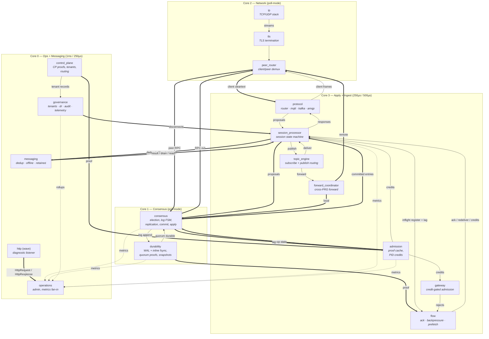

# Quantum Architecture

Quantum is a multi-protocol message broker composed as a graph of
cooperative `.fmod` modules on the fluxor runtime, atop the clustor
Raft replication substrate. A single process serves MQTT
3.1/3.1.1/5.0, Kafka, and AMQP 0-9-1 with durability-gated
acknowledgements, deterministic backpressure, and a uniform on-disk
format across all three protocols.

A deployed broker graph is **14 modules across six execution
domains**: the 7-module clustor substrate plus 7 quantum modules —
protocol codecs and routing, a unified session state machine, topic
and messaging infrastructure, flow control, cross-PRG forwarding,
governance. Graphs that want the HTTP diagnostic/admin surface add
wave's `http` module (`app` variant) on its own listener; bare-metal
deployments add the fluxor `tls` foundation module.

This document is the structural reference: the layering, the
execution model, every module and what it owns, the message graph,
and the durability cascade. Each concern (messaging entities,
partitioning, per-protocol adapters, security, and so on) has its own
document under [architecture/](architecture/); this document links to
them rather than restating their contracts. The canonical deployment
config is embedded in [the run guide](guides/running.md).

## System model

Three layers compose into one process:

| Layer | Provided by | Responsibility |
|-------|-------------|----------------|
| Foundation | fluxor | TCP/UDP transport (`linux_net` / `ip`), TLS 1.3 (`tls`), QUIC (`quic`), the module SDK/ABI, and the cooperative scheduler |
| Substrate | clustor | Raft consensus and replication, the WAL, durability proofs and snapshotting, admission control, the control-plane bridge, the admin surface — 7 modules |
| Application | quantum | Protocol codecs, session state, topic routing, messaging infrastructure, flow control, forwarding, governance — 7 modules |

Every module exposes a `step()` function the scheduler calls on a
fixed tick (or in poll-mode). Modules never share memory or call each
other directly; they communicate only over declared **channel edges**
between named output and input ports. State lives in bounded,
statically-sized arenas declared in each module's `manifest.toml` —
no heap, no allocator, no async runtime. This is what makes step time
bounded and scheduling deterministic.

**Pipelining within a tick.** A module that consumed a record returns
`StepOutcome::Burst`, which re-runs the domain's exec rotation inside
the same tick up to the kernel's pass cap. Without it each edge
against the execution order — every reply path, and every tee/merge
the kernel inserts, since fan modules are ordered after all real ones
— costs a full tick, so a publish round-trip would pay one tick per
hop. Modules burst only when a record was actually consumed, so an
idle graph still costs exactly one pass per tick.

## Execution domains

Modules are grouped into **six execution domains**. Each domain runs
on one or more cores at a fixed tick rate (or poll-mode for the
hottest paths). Domain placement co-locates modules that exchange
messages on the hot path, so cross-core wakeups are reserved for
genuine domain boundaries.

| Domain | Tier / tick | Modules | Concern |
|--------|-------------|---------|---------|
| `network` | poll-mode | `linux_net` / `ip`, `tls`, `peer_router` | Transport I/O, TLS termination, peer and client demux |
| `consensus` | poll-mode | `consensus`, `durability` | Raft FSM, replication, commit and apply ordering, persistence; `durability` fsyncs inline |
| `apply` | 250µs | `gateway`, `admission`, `session_processor`, `flow`, `forward_coordinator` | Request admission, response framing, the session state machine |
| `ingest` | 500µs | `protocol` (router, mqtt, kafka, amqp), `topic_engine` | Protocol parsing/framing and subscription matching |
| `messaging` | 250µs | `messaging` | Store-and-forward state |
| `ops` | 1ms | `control_plane`, `operations`, `governance` | Control plane, governance, admin, observability |

**Core mapping.** On a 4-core Pi 5 the six domains fold onto four
cores: `ingest` co-locates with `apply` on core 3, and `messaging`
co-locates with `ops` on core 0. On systems with six or more cores
each domain takes its own core. Co-location changes only whether an
edge is intra-core or cross-core; it does not change wiring.

```
Core 0  ops + messaging     1ms cooperative / 250µs
Core 1  consensus           poll-mode (consensus, durability)
Core 2  network             poll-mode (ip, tls, peer_router)
Core 3  apply + ingest      250µs / 500µs
```

## Module reference

### Foundation modules

Foundation modules come from fluxor. The transport endpoint is
supplied by the runtime rather than declared in the graph's
`modules:` list — `linux_net` under `fluxor-linux`, `ip` on bare
metal — so it does not count against the module totals above; graphs
simply wire to it.

| Module | Domain | Description |
|--------|--------|-------------|
| `linux_net` / `ip` | network | TCP + UDP transport with connection tracking, carrying all client and peer traffic. `linux_net` is the `fluxor-linux` builtin; `ip` is the bare-metal equivalent, wired directly to the NIC stack. |
| `tls` | network | TLS 1.3 termination. Instantiated in the bare-metal graph. |
| `quic` | network | QUIC server with ALPN. Instantiated only in the MQTT-over-QUIC graph, where `mqtt_quic_adapter` bridges its stream surface to `protocol`. |

### Clustor substrate (7 modules)

Quantum inherits the clustor module set; clustor's own documentation
is authoritative for their internals. The one-line roles, as quantum
consumes them:

| Module | Domain | Role in the quantum graph |
|--------|--------|---------------------------|
| `peer_router` | network | Wire demux between the peer path (→ `consensus`) and the client path (→ `protocol` and `gateway`); owns the TCP listener. |
| `consensus` | consensus | Raft FSM: proposal batching, replication, quorum commit, ordered and deduplicated apply delivery. Quantum's `session_processor` is the apply consumer. See [the propose/apply seam](architecture/apply_path.md). |
| `durability` | consensus | Segment WAL with per-entry or grouped fsync (`fsync_mode`, `group_window_ms`, `group_max_pending`), durability-proof emission on `quorum_durable`, snapshots. |
| `gateway` | apply | Generic request envelope and credit-gated admission: consumes tokens on `credit_supply`, emits over-envelope requests on `rejected`. |
| `admission` | apply | Control-plane proof cache FSM (Fresh/Cached/Stale/Expired) and the dual-token PID controller for proposal admission; emits `credits` and drives `consensus.cp_state`. See [architecture/flow_control.md](architecture/flow_control.md). |
| `control_plane` | ops | Control-plane bridge emitting proofs, tenant records, capability manifests, and routing epochs. See [architecture/control_plane.md](architecture/control_plane.md) for its current status. |
| `operations` | ops | Metrics fan-in and the admin/diagnostic surface (`/readyz`, `/why`, `/metrics`, `/admin`) behind wave's `http` module; role-gated admin workflows. |

The single-node graph in the run guide also wires clustor's
standalone `partition_router` module, which fans untagged proposals
across partitions.

### Quantum application modules (7)

These modules implement the broker. They plug into the substrate via
`consensus` and extend the graph with protocol routing, codecs,
session management, messaging infrastructure, flow control,
forwarding, and governance.

#### Protocol routing and codecs

| Module | Domain | Description |
|--------|--------|-------------|
| `protocol` | ingest | Composite of four components. Unlike the other composites these genuinely interact: **router** classifies each connection from its first bytes (up to 16) and pins the verdict, and the dispatch table hands the record straight to the owning codec rather than across a graph edge. **mqtt** — 3.1/3.1.1/5.0 parser and framer with MQTT 5 property support (subscription identifiers, topic aliases, user properties, reason strings). **kafka** — binary protocol codec with request/response correlation and API-version negotiation. **amqp** — 0-9-1 frame parser: Connection/Channel/Queue/Basic/Confirm methods, content header/body reassembly. Responses arrive on one shared bus, are demuxed by the dispatch table on the session's protocol tag, and are encoded onto one shared `frames_out`. Variants `full` (default) / `mqtt` / `kafka` / `amqp` compile out the codecs a deployment does not serve. |

Adapter-level semantics are specified in
[architecture/mqtt_adapter.md](architecture/mqtt_adapter.md),
[architecture/kafka_adapter.md](architecture/kafka_adapter.md), and
[architecture/amqp_adapter.md](architecture/amqp_adapter.md).

#### Session processor

| Module | Domain | Description |
|--------|--------|-------------|
| `session_processor` | apply | The unified session state machine for all protocols — quantum's core application module and the Raft apply consumer that plugs into `consensus`. Decomposed into four components — **sessions** (the session arena and per-session QoS inflight), **store** (the protocol-neutral durable-publish and message-log primitive shared by Kafka and AMQP), **consumers** (consumer groups, offsets, AMQP push consumers), and **correlate** (correlation tables and the commit-gating stash) — stepped in a fixed phase sequence; the component split and the rules each enforces are in [architecture/session_decomposition.md](architecture/session_decomposition.md). Variants `full` (default) / `mqtt` / `kafka` / `amqp` compile out the protocols a deployment does not serve. |

The session processor folds in three concerns that share state with
the session record: connection lifecycle (CONNECT/DISCONNECT/
keep-alive/Will/takeover), epoch fencing, and protocol credit
translation. It does **not** absorb ACK tracking, backpressure
propagation, or consumer prefetch — those have independent timers,
state shapes, and operational ownership and live in `flow`. Its step
function runs six phases:

1. **Inbound dispatch** — drain and classify codec inputs.
2. **Session lifecycle** — CONNECT binding, epoch fencing,
   clean/persistent sessions, keep-alive, Will scheduling, takeover.
3. **Publish processing** — dedup query, QoS 2 four-phase state,
   emission to `topic_engine`.
4. **Credit translation** — protocol-native flow hints derived from
   admission credit headroom.
5. **Apply loop** — apply committed entries deterministically.
6. **Proposal emission** — encode durable mutations as canonical
   proposals, emit to `consensus`.

Durable mutation happens only on the apply side (phase 5), so
followers and post-restart replay converge on the same state as the
leader. That seam is specified in
[architecture/apply_path.md](architecture/apply_path.md).

#### Flow control and acknowledgement

| Module | Domain | Description |
|--------|--------|-------------|
| `flow` | apply | Composite of three components, each closing a different flow-control loop around the session state machine. **ack** — per-message inflight keyed by `(partition_id, wal_index)`, consuming `durability.quorum_durable` proofs and mapping them to protocol ACKs (PUBACK, PUBREC/PUBCOMP, Kafka ProduceResponse, AMQP Basic.Ack); a timer scan detects timeouts and redelivers with backoff (base 1s, max 60s, 10 attempts). **backpressure** — maps substrate pressure to protocol-native responses (MQTT `0x97`, Kafka `THROTTLING_QUOTA_EXCEEDED`, AMQP flow control), tracking queue depths against thresholds (pause-ack at 10 000, drop-QoS-0 at 5 000). **prefetch** — per-session consumer prefetch (default 10-message window), adaptively scaled on apply-to-delivery lag. Each component emits telemetry under its own metric identity. See [architecture/flow_control.md](architecture/flow_control.md). |

#### Topic engine

| Module | Domain | Description |
|--------|--------|-------------|
| `topic_engine` | ingest | Subscription matching and publish-time fan-out. MQTT wildcards (`+`, `#`), shared-subscription distribution by stable hash modulo group size, cross-PRG forward emission with a `forward_seq` idempotence key. |

#### Messaging infrastructure

| Module | Domain | Description |
|--------|--------|-------------|
| `messaging` | messaging | Composite of three components sharing one request bus (`op_in`) and one reply bus (`result_out`), demuxed by frame type. **dedup** — session-scoped deduplication (16-shard map, 72h TTL, periodic GC); QoS 2 four-phase state for MQTT. **offline** — persistent FIFO for disconnected sessions, drain-on-reconnect in sequence order. **retained** — retained-message storage, topic-indexed and wildcard-matched for new-subscription delivery; payloads are stored inline. Each component emits telemetry under its own metric identity. |

#### Cross-PRG forwarding

| Module | Domain | Description |
|--------|--------|-------------|
| `forward_coordinator` | apply | Cross-PRG forwarding with `forward_seq` idempotence, tracking `(ingress_prg, egress_prg, routing_epoch) → monotone_seq` persisted in PRG state for the WAL replay fence. Same-node forwards use intra-domain channels; cross-node forwards emit routed envelopes to `peer_router`. |

#### Governance

| Module | Domain | Description |
|--------|--------|-------------|
| `governance` | ops | Composite of four components. **tenants** — tenant policy enforcement over the records `control_plane` emits: per-tenant token buckets, noisy-neighbour detection (sustained overage over 60s triggers disconnect events to `session_processor`), quota signals to `gateway.credit_supply`. **dr** — the disaster-recovery orchestration state machine (checkpoint scheduling, promotion gating); see [architecture/disaster_recovery.md](architecture/disaster_recovery.md) for its current status. **audit** — sequence-numbered, HMAC-SHA256-chained structured events. **telemetry** — dimensional aggregation with cardinality limiting (100 000 unique label sets), forwarding rollups to `operations.ingest`. The tenants and dr components reach audit and telemetry over in-module seam rings rather than graph edges. See [architecture/multi_tenancy.md](architecture/multi_tenancy.md) and [architecture/observability.md](architecture/observability.md). |

### Present in the tree, not in any deployment graph

These modules build but no deployment config wires them. Listed here
so they are mistaken neither for dead code on one hand, nor for
shipped behaviour on the other.

| Module | Status |
|--------|--------|
| `mqtt_sink`, `kafka_sink`, `amqp_sink` | Outbound message sinks exposing the generic `stream.sink.ordered_ack` surface: a producer hands each message a correlation id, and the sink acknowledges only on durable acceptance by the remote broker (MQTT PUBACK, Kafka `acks=-1` ProduceResponse, AMQP publisher confirm). Per-key order is preserved by serialised sends; connection loss invalidates the in-flight window and signals exactly the set the producer must re-publish. Built for change-data-capture pipelines; not yet wired into a deployment graph. |
| `mqtt_client`, `kafka_client`, `amqp_client`, `nats_client` | Outbound connectors to *external* brokers — the mirror of the inbound broker surface, letting a quantum graph bridge to a foreign endpoint. Their protocol cores live at `modules/common/cores/`, reached the same way as `modules/common/wire.rs`; keeping them out of the fluxor SDK source avoids invalidating the ABI source pin. Kafka, AMQP, and NATS connectivity is owned here outright; MQTT is deliberately split, with fluxor keeping a thin reachability client and quantum keeping the broker. |
| `capability_registry` | Advertises this node's `(StorageSurface, FenceKind)` offering on `local_ad` and consumes peers' on `peer_ad`, so a deployment-time matcher can refuse a consumer whose fence requirement outranks what the node offers. Making it real needs a multi-node design decision: who consumes the advertisements, and when the match is enforced. |

## Message graph

The canonical deployment config is embedded in
[the run guide](guides/running.md); the wiring below is the *shape*
of that graph, and the embedded YAML is authoritative for exact ports
and channel parameters.

Simplified topology:

```
ip ↔ tls → peer_router ──→ protocol { router → mqtt | kafka | amqp }
                     │                              ↓
   session_processor ←──────────────────── (codec proposals)
     │  ↑ durability (ACK proofs, via flow's ack component)
     │  ↑ admission (PID credits)
     ↓
   consensus (Raft, replication, quorum commit, ordered apply)
     ⇅
   durability (WAL, inline fsync, quorum proof, snapshots)
     ↓
   session_processor (apply loop)
     ↓
   topic_engine → forward_coordinator → peer_router (cross-node)
     ↓
   messaging (dedup / offline / retained)
```

The MQTT QoS 1 publish hot path crosses five domain boundaries on a
4-core Pi 5 (peer→ingest, apply→consensus, consensus→apply for
commit, consensus→apply for the durability proof, ingest→network for
the response). The crossings are small against fsync and network
round-trip time; placement is chosen so that the modules on the hot
path share a core.

## Architecture diagram



Legend: `-->` intra-domain edge, `==>` cross-core edge, `-.->`
metrics (best-effort, never on the hot path).

## Durability model

Every observable effect stems from a WAL entry or a snapshot
(**WAL-SOURCE**), and protocol ACKs emit only after quorum durability
(**ACK-DURABILITY**). These invariants and their siblings are defined
in [architecture/messaging_model.md](architecture/messaging_model.md);
the cascade that enforces them:

```
session_processor.proposals
  →[cross-core]→ consensus.proposals (batched)
  → consensus.log_append → durability.entries
        (inline fsync — per-entry, or a group window)
  → durability.quorum_durable (quorum proof)
  ├─→[cross-core]→ flow (ack) → session_processor (inline ACK emission)
  └─→ consensus.durable (quorum commit, then ordered and deduplicated
         apply)
      →[cross-core]→ consensus.committed_entries
      → session_processor (apply committed entries)
```

The path forks at `durability.quorum_durable`: durability proofs
reach `flow`'s ack component for ACK emission, and committed entries
reach `session_processor` once `consensus` has ordered and
deduplicated them. This is safe because ACK emission is idempotent
and an operation is complete only once its entry is both durably
acknowledged and applied. The apply half — how committed entries
drive every durable mutation so followers and replay converge — is
specified in [architecture/apply_path.md](architecture/apply_path.md).

## QoS mapping across protocols

Each protocol's delivery guarantees map onto the same durability
cascade. Per-protocol semantics are specified in the adapter
documents; the cross-protocol view:

| Semantic | MQTT | Kafka | AMQP 0-9-1 |
|----------|------|-------|------------|
| Fire-and-forget | QoS 0 | `acks=0` | Non-confirm publish |
| At-least-once | QoS 1 (PUBACK after quorum) | `acks=1`/`acks=all` (both wait for quorum) | Basic.Ack after WAL durability (confirm mode) |
| Exactly-once | QoS 2 (four-phase, each quorum-durable) | Not offered — transactions are not implemented (see [architecture/kafka_adapter.md](architecture/kafka_adapter.md)) | Not offered — transactions are not implemented (see [architecture/amqp_adapter.md](architecture/amqp_adapter.md)) |

## Related documents

- [overview.md](overview.md) — documentation map and conventions
- [architecture/messaging_model.md](architecture/messaging_model.md) — entities, invariants, terminology
- [architecture/apply_path.md](architecture/apply_path.md) — the propose/apply seam and snapshot format
- [architecture/partitioning.md](architecture/partitioning.md) — PRG sharding, routing epochs, placement
- [architecture/session_decomposition.md](architecture/session_decomposition.md) — `session_processor`'s component split and its rules
- Adapter contracts: [mqtt](architecture/mqtt_adapter.md), [kafka](architecture/kafka_adapter.md), [amqp](architecture/amqp_adapter.md)
- Cross-cutting concerns: [control plane](architecture/control_plane.md), [multi-tenancy](architecture/multi_tenancy.md), [flow control](architecture/flow_control.md), [security](architecture/security.md), [observability](architecture/observability.md), [disaster recovery](architecture/disaster_recovery.md)
- Operating the broker: [guides/](guides/) — running, configuration, deployment, scaling
