# Quantum Architecture

Quantum is a multi-protocol message broker composed as a graph of
cooperative `.fmod` modules on the [Fluxor](../../fluxor) runtime, atop
the [Clustor](../../clustor) Raft replication substrate. A single
process serves MQTT 3.1/3.1.1/5.0, Kafka, and AMQP 0-9-1 with
quorum-durable exactly-once semantics, multi-tenant isolation,
deterministic backpressure, and a uniform on-disk format across all
three protocols.

The graph is **14 modules across 6 execution domains**: the 7-module
Clustor substrate plus 7 Quantum-specific modules — protocol codecs
and routing, a unified session state machine, topic and messaging
infrastructure, flow control, cross-PRG forwarding, control-plane
enforcement, and observability. Bare-metal deployments add the `tls`
foundation module for a 15-module graph.

This document is the structural reference: the layering, the execution
model, every module and what it owns, the message graph, and the
durability cascade. Each concern (messaging entities, partitioning,
per-protocol adapters, security, and so on) has its own normative
document under [architecture/](architecture/); this document links to
them rather than restating their contracts. The canonical, wireable
graph lives in [configs/](../configs/).

## System model

Three layers compose into one process:

| Layer | Provided by | Responsibility |
|-------|-------------|----------------|
| Foundation | Fluxor | TCP/UDP transport (`linux_net` / `ip`), TLS 1.3 (`tls`), QUIC (`quic`), fault injection (`test_fault`), the module SDK/ABI, and the cooperative scheduler |
| Substrate | Clustor | Raft consensus and replication, the WAL, durability proofs and snapshotting, the client and admin surface, admission control, the control-plane bridge, key management, RBAC and telemetry — 7 modules |
| Application | Quantum | Protocol codecs, session state, topic routing, messaging infrastructure, flow control, forwarding, tenant enforcement, observability — 7 modules |

Every module exposes a `step()` function the scheduler calls on a fixed
tick (or in poll-mode). Modules never share memory or call each other
directly; they communicate only over declared **channel edges** between
named output and input ports. State lives in bounded, statically-sized
arenas declared in each module's `manifest.toml` — no heap, no
allocator, no async runtime. This is what makes step time bounded and
scheduling deterministic.

**Pipelining within a tick.** A module that consumed a record returns
`StepOutcome::Burst`, which re-runs the domain's exec rotation inside
the same tick up to the kernel's pass cap. Without it each edge against
the execution order — every reply path, and every tee/merge the kernel
inserts, since fan modules are ordered after all real ones — costs a
full tick, so a publish round-trip paid one tick per hop. Modules burst
only when a record was actually consumed, so an idle graph still costs
exactly one pass per tick. Measured on the single-node Linux graph at
`tick_us: 1000`, enabling this took QoS-1 publish latency from
p50 7.6 / p99 ~10 ms to p50 3.4 / p99 4.7 ms.

## Execution domains

Modules are grouped into **six execution domains**. Each domain runs on
one or more cores at a fixed tick rate (or poll-mode for the hottest
paths). Domain placement co-locates modules that exchange messages on
the hot path, so cross-core wakeups are reserved for genuine domain
boundaries.

| Domain | Tier / tick | Modules | Concern |
|--------|-------------|---------|---------|
| `network` | poll-mode | `linux_net` / `ip`, `tls`, `peer_router` | Transport I/O, TLS termination, peer and client demux |
| `consensus` | poll-mode | `consensus`, `durability` | Raft FSM, replication, commit and apply ordering, and persistence, walked inline on one core; `durability` fsyncs inline |
| `apply` | 250µs | `gateway`, `admission`, `session_processor`, `flow`, `forward_coordinator` | Request admission, response framing, and the session state machine |
| `ingest` | 500µs | `protocol`'s router component, `protocol`'s mqtt component, `protocol`'s kafka component, `protocol`'s amqp component, `topic_engine` | Protocol parsing/framing and subscription matching |
| `messaging` | 250µs | `messaging` | Store-and-forward state |
| `ops` | 1ms | `control_plane`, `operations`, `governance`'s tenants component, `governance`'s dr component, `governance`'s audit component, `governance`'s telemetry component | Control plane, security, admin, observability |

**Core mapping.** On a 4-core Pi 5 the six domains fold onto four cores:
`ingest` co-locates with `apply` on core 3, and `messaging` co-locates
with `ops` on core 0. On 6-or-more-core systems each domain takes its
own core (messaging on core 4 at 250µs, ingest on core 5 at 500µs).
Co-location changes only whether an edge is intra-core or cross-core; it
does not change wiring.

```
Core 0  ops + messaging     1ms cooperative / 250µs
Core 1  consensus           poll-mode (consensus, durability)
Core 2  network             poll-mode (ip, tls, peer_router)
Core 3  apply + ingest      250µs / 500µs
```

## Module reference

### Foundation modules

| Module | Domain | Description |
|--------|--------|-------------|
Foundation modules come from Fluxor, not Quantum. The transport endpoint
is supplied by the runtime rather than declared in the graph's `modules:`
list — `linux_net` under `fluxor-linux`, `ip` on bare metal — so it does
not count against the module totals above; graphs simply wire to it.

| Module | Domain | Description |
|--------|--------|-------------|
| `linux_net` / `ip` | network | TCP + UDP transport with connection tracking, carrying all client, peer, and control-plane traffic. `linux_net` is the `fluxor-linux` builtin; `ip` is the bare-metal equivalent, wired directly to the NIC stack. |
| `tls` | network | TLS 1.3 (ChaCha20-Poly1305, AES-GCM, P-256 ECDH); mTLS termination with SPIFFE identity and X.509 validation; SNI metadata for demux. Instantiated in the bare-metal graph. |
| `quic` | network | QUIC server (RFC 9000 + 9001) with ALPN. Instantiated only in the MQTT-over-QUIC graph, where `mqtt_quic_adapter` bridges its stream surface to `protocol`. |

### Clustor substrate (7 modules)

Quantum inherits the full Clustor module set, documented in
[Clustor's documentation](../../clustor/docs/overview.md) and
summarised here. Each substrate module is a single scheduling unit
whose internal components share arenas and step in a fixed order, so
the hot paths through Raft, persistence, and admission cost no channel
hops.

| Module | Domain | Description |
|--------|--------|-------------|
| `peer_router` | network | Multi-peer Raft routing: identity handshakes, outbound CMD_CONNECT with reconnect backoff, demux of inbound traffic between the peer path (→ `consensus`) and the client path (→ `protocol`'s router component and `gateway`). Also carries cross-node forward envelopes from `forward_coordinator` and snapshot manifest authentication. |
| `consensus` | consensus | Raft FSM, replication, commit determination, and ordered apply. Election terms, pre-vote, heartbeats (150ms), proposal batching (256 max, 100µs flush), leadership transfer; proposals carry `WorkloadForwardEnvelope` for protocol-agnostic replication. Pipelines AppendEntries to followers (4 MiB batches), collects `DurabilityAck`s, updates match indices, and detects structural lag (256 MiB), emitting `lag_signal`. Computes quorum commit from match indices plus durability acks, gated on durability mode (Strict/GroupFsync/Relaxed) with the CP strict-fallback override applied through `cp_state`. Delivers committed entries to `session_processor` in order and deduplicated (16-shard dedup) on `applied` / `committed_entries`, and consumes `read_permits` to gate linearizable reads. See [the propose/apply seam](architecture/apply_path.md). |
| `durability` | consensus | AEAD-encrypted WAL (AES-256-GCM), 64 MiB segment rotation, binary framing, accepting `entries` from `consensus.log_append` and answering `entry_request` on replay gaps. fsync cadence is internal: `fsync_mode = 0` (default) fsyncs per entry; `fsync_mode = 1` batches writes in a `group_window_ms` / `group_max_pending` window and emits one combined `FsyncAck`. Entries encode session records, dedupe maps, offline queues, retained messages, consumer-group state, transaction markers, and forward sequences. Publishes per-node fsynced indices and `quorum_durable` proofs — `AckContract` binds protocol ACKs to these proofs, and `flow`'s ack component consumes them directly for inline emission. Takes full + incremental snapshots (512 MiB trigger, 8-delta chain) with 1 MiB chunked export (200 Mbps throttled), AEAD + Ed25519 signing, and a signed `manifest_auth`, capturing the Quantum application state enumerated in [the propose/apply seam](architecture/apply_path.md). Holds the DEK/KEK epoch watcher: weekly rotation, 48h retention, nonce reservation for WAL, snapshot, and TLS consumers. |
| `gateway` | apply | Generic request envelope and client/admin surface: validates the placement epoch from `control_plane.routing`, frames responses on `responses`, and routes `/readyz`, `/why`, `/admin`, `/raft`, `/metrics` — readiness covers CP freshness, PRG replay completion, strict-fallback status, and listener drain status, fed by `operations` on `readyz_data` / `why_data` / `metrics_data`. Credit-based admission consumes tokens on `credit_supply` from `admission` and per-tenant quota signals from `governance`'s tenants component, emitting admitted proposals on `proposals_tagged` and over-envelope requests on `rejected`. Protocol-specific parsing is done by the codec modules upstream. |
| `admission` | apply | CP proof cache FSM (Fresh/Cached/Stale/Expired), fresh 60s, grace 120s: Stale blocks new CONNECTs requiring policy evaluation, Expired tears down policy-bound sessions, and `cache_state` / `strict_fallback` drive `consensus.cp_state`. Issues linearizable read `permits` by quorum CP proof equality — session queries and retained-message reads require permits. Runs the dual-token PID controller (Q16.16 fixed-point) for proposal admission — entry credits (4096 max) + byte credits (64 MiB max) driven by the replication `lag` signal, with Latency/Throughput/WAN profiles, 100ms sample period, and anti-windup clamping; emits `credits`. Consumer-side prefetch is `flow`'s prefetch component's concern. See [architecture/flow_control.md](architecture/flow_control.md). |
| `control_plane` | ops | HTTP client to CP-Raft emitting four output classes: (1) `proof` on a state-dependent schedule, (2) `tenant_records` (PRG count, quotas, ACLs, certificates, compliance policies) consumed by `governance`'s tenants component, (3) `capabilities` manifests (feature gates, QoS ceilings, schema versions) consumed by `session_processor`, and (4) `routing` — epoch-based partition routing (`hash64(tenant_id, client_id) % prg_count` for sessions, `hash64(tenant_id, topic) % prg_count` for topics) with `epoch_events` so `session_processor` can fence sessions on rebalance. See [architecture/partitioning.md](architecture/partitioning.md). |
| `operations` | ops | Role gating (Operator/TenantAdmin/Observer/BreakGlass) on `admin_req`, break-glass SPIFFE validation with a short, CP-bounded TTL, and `denied` / `identity` / `audit_events` outputs; tenant ACLs gate per-protocol publish/subscribe/admin operations (see [architecture/security.md](architecture/security.md)). Runs idempotency-keyed admin workflows on `admin_requests`: partition CRUD, durability-mode toggle, leadership transfer, shrink/grow plans, snapshot triggers, throttle overrides, and PRG lifecycle (create/destroy/rebalance with io_profile + disk_tier + resource_budget), emitting `raft_commands` and `responses`. One-shot commands only; long-running DR orchestration is `governance`'s dr component. Aggregates substrate metrics on `ingest` with a global storm guard and incident correlation, exporting `readyz` / `why` / `export` to `gateway`. Quantum's high-cardinality metrics arrive as rollups from `governance`'s telemetry component; audit events flow through `governance`'s audit component. |

### Quantum application modules (19)

These modules implement the broker. They plug into the substrate via
`consensus` and extend the graph with protocol routing, codecs,
session management, messaging infrastructure, flow control, forwarding,
control-plane enforcement, and observability.

#### Protocol routing & codecs (4)

| Module | Domain | Description |
|--------|--------|-------------|
| `protocol` | ingest | Composite of four components. Unlike the other composites these genuinely interact: **router** classifies each connection from its first bytes (up to 16) and pins the verdict, and the dispatch table hands the record straight to the owning codec rather than across a graph edge. **mqtt** — 3.1/3.1.1/5.0 parser and framer with MQTT 5 property support (subscription IDs, topic aliases, user properties, reason strings, server keep-alive). **kafka** — binary protocol codec with request/response correlation and API-version negotiation. **amqp** — 0-9-1 frame parser: Connection/Channel/Queue/Basic/Confirm methods, content header/body reassembly. Responses arrive on one shared bus and are demuxed by the dispatch table on the session proto tag, then encoded onto one shared `frames_out`, so response multiplexing needs no separate module. Variants `full` (default) / `mqtt` / `kafka` / `amqp` compile out the codecs a deployment doesn't serve: the kafka-only artifact is 13 KB against 51 KB for the full build. |

The three protocols have different wire formats, connection models, and
state machines, so each codec is its own module. Separate modules also
run at their own tick rates — MQTT and AMQP need faster response framing
than Kafka's batch-oriented model — and keep each codec independently
testable and reusable outside Quantum. Adapter-level semantics are
normative in [architecture/mqtt_adapter.md](architecture/mqtt_adapter.md),
[architecture/kafka_adapter.md](architecture/kafka_adapter.md), and
[architecture/amqp_adapter.md](architecture/amqp_adapter.md).

#### Session processor (1)

| Module | Domain | Description |
|--------|--------|-------------|
| `session_processor` | apply | The unified session state machine for all protocols — Quantum's core application module and the Raft apply callback that plugs into `consensus`. Decomposed into four components — **store** (Kafka partition rings), **correlate** (correlation and inflight tables), **consumers** (AMQP/Kafka consumer state), and **sessions** (the session arena) — over the step function's Phase 1…6 sequence; the rationale and the rules each component enforces are in [architecture/session_decomposition.md](architecture/session_decomposition.md). Variants `full` (default) / `mqtt` / `kafka` / `amqp` compile out the protocols a deployment doesn't serve. |

The session processor folds in three concerns that share state with the
session record: connection lifecycle (CONNECT/DISCONNECT/keep-alive/Will/
takeover), epoch fencing, and protocol credit translation. It does **not**
absorb ACK tracking, backpressure propagation, or consumer prefetch —
those have independent timers, state shapes, and operational ownership
and live in their own modules. Its step function runs six phases:

1. **Inbound dispatch** — drain and classify codec inputs.
2. **Session lifecycle** — CONNECT binding, epoch fencing, clean/
   persistent sessions, keep-alive, Will scheduling, takeover.
3. **Publish processing** — dedup query, QoS 2 four-phase state, emit to
   `topic_engine`.
4. **Credit translation** — protocol-native hints from PID output, e.g.
   `mqtt_receive_max = base_window × (0.5 + 0.5 × headroom) × follower_factor`.
5. **Apply loop** — apply committed entries deterministically.
6. **Proposal emission** — wrap durable mutations in
   `WorkloadForwardEnvelope`, emit to `consensus`.

Durable mutation happens only on the apply side (phase 5), so followers
and post-restart replay converge on the same state as the leader. That
seam is normative in
[the propose/apply seam document](architecture/apply_path.md).

#### Flow control & acknowledgement (3)

| Module | Domain | Description |
|--------|--------|-------------|
| `flow` | apply | Composite of three components, each closing a different flow-control loop around the session state machine. They share the session's outbound bus (`forward_in`, carrying both ack registrations and lag signals) and reply on two ports because they land on two different session inputs. **ack** — per-message inflight keyed by `(partition_id, wal_index)`, consuming `durability.quorum_durable` proofs and mapping them to protocol ACKs (PUBACK, PUBREC/PUBREL/PUBCOMP, Kafka ProduceResponse, AMQP Basic.Ack/Nack); a timer scan detects timeouts and redelivers with backoff (base 1s, max 60s, 10 attempts). **backpressure** — maps substrate backpressure to protocol-native responses (MQTT `0x97` Quota exceeded, Kafka `THROTTLING_QUOTA_EXCEEDED`, AMQP `drain`), tracking queue depths and thresholds (pause-ack at 10K, drop-QoS-0 at 5K). **prefetch** — per-session consumer prefetch (default 10-message window), adaptively scaled on apply-to-delivery lag, a different signal than `admission`'s replication-lag PID; Kafka fetch-session quota, AMQP Basic.Qos. Each component emits telemetry under its own `metric_id`. |

#### Topic engine (1)

| Module | Domain | Description |
|--------|--------|-------------|
| `topic_engine` | ingest | Unified subscription matching and publish-time fan-out. MQTT wildcards (`+`, `#`), Kafka topic-partition assignment, AMQP binding patterns. Resolves publish targets to subscriber sets; local subscribers get direct delivery, cross-PRG targets get `ForwardPublish` with a `forward_seq` idempotence key. Distributes shared subscriptions by stable hash modulo group size. |

#### Messaging infrastructure (3)

| Module | Domain | Description |
|--------|--------|-------------|
| `messaging` | messaging | Composite of three components sharing one request bus (`op_in`) and one reply bus (`result_out`), demuxed by frame type. **dedup** — session/tenant-scoped deduplication (default 72h), 16-shard map, periodic GC; QoS 2 four-phase state for MQTT, idempotent-producer tracking for Kafka, delivery-tag tracking for AMQP; maintains `earliest_dedupe_index` per PRG for safe WAL compaction. **offline** — persistent FIFO for disconnected/throttled sessions, per-message expiry, drain-on-reconnect in sequence order; maintains `earliest_offline_queue_index` per PRG. **retained** — retained-message storage, topic-indexed and wildcard-matched for new-subscription delivery. Each component emits telemetry under its own `metric_id` so the aggregator keys per component. |

#### Cross-PRG forwarding (1)

| Module | Domain | Description |
|--------|--------|-------------|
| `forward_coordinator` | apply | Cross-PRG forwarding with `forward_seq` idempotence, tracking `(ingress_prg, egress_prg, routing_epoch) → monotone_seq` persisted in PRG state for the WAL replay fence. Protocol-agnostic via `WorkloadForwardEnvelope`. Same-node forwards use intra-domain channels; cross-node forwards emit routed envelopes to `peer_router`. |

#### Group & transaction coordination (2)

| Module | Domain | Description |
|--------|--------|-------------|

#### Control-plane enforcement (1)

| Module | Domain | Description |
|--------|--------|-------------|
| `governance` | ops | Composite of four components. **tenants** — tenant policy enforcement over the records `control_plane` emits: per-tenant token buckets, noisy-neighbour detection (sustained overage >60s triggers disconnect events to `session_processor`), quota signals to `gateway.credit_supply`; enforcement is distinct from `control_plane`'s data fetching. **dr** — checkpoint export scheduling, WAL archive shipping, the controlled-promotion state machine (FenceCommit → durability verify → promote); multi-step and long-running, distinct from `operations`' one-shot admin commands. **audit** — sequence-numbered, HMAC-signed structured events from `operations`, `session_processor`, and the tenants and dr components; tamper-evident and compliance-bound, distinct from `operations`' best-effort counters. **telemetry** — high-cardinality dimensional aggregation (tenant × protocol × PRG) with cardinality limiting, forwarding rollups to `operations.ingest`. tenants' and dr's own audit events and counters reach audit and telemetry over in-module seam rings rather than graph edges. See [architecture/multi_tenancy.md](architecture/multi_tenancy.md), [disaster_recovery.md](architecture/disaster_recovery.md), [observability.md](architecture/observability.md). |

#### Operations & observability (3)

| Module | Domain | Description |
|--------|--------|-------------|

Two of `messaging`'s components — dedup and offline — are
protocol-agnostic (they operate on opaque keys and payloads) and are
candidates for extraction into the Fluxor foundation set alongside `ip`,
`tls`, and `http`, where any store-and-forward or exactly-once
application could reuse them. Each is liftable back into a standalone
graph module by reintroducing a manifest and replacing its
message-shaped calls with ports.

### Present in the tree, not in any deployment graph

These modules build but no deployment config wires them. Listed here so
they are mistaken neither for dead code on one hand, nor for shipped
behaviour on the other.

| Module | Status |
|--------|--------|
| `capability_registry` | Advertises this node's `(StorageSurface, FenceKind)` offering on `local_ad` and consumes peers' on `peer_ad`, so a deployment-time matcher can refuse a consumer whose fence requirement outranks what the node offers. Not instantiated in any graph: wiring only `metrics` (leaving `local_ad` and `peer_ad` unconnected) costs a module slot and a channel to emit counters that are always zero. Making it real needs a multi-node design decision: who consumes the advertisements, and when the match is enforced. |
| `amqp_client`, `kafka_client`, `nats_client` | Outbound connectors to *external* brokers — the mirror of the inbound broker surface, letting a Quantum graph bridge to a foreign Kafka, AMQP, or NATS endpoint. Each is wired in its own runnable example under [examples/](../examples/) rather than in a deployment config. Their protocol cores (`amqp_core`, `kafka_core`, `nats_core`, `resp_core`, `hex_core`) live at `modules/common/cores/`, reached the same way as `modules/common/wire.rs` — keeping them out of `fluxor/modules/sdk/` avoids invalidating the ABI source pin, which would force a cross-project restage of every downstream `.fmod`. Ownership is Quantum's per `rfc_connector_strategy.md` §4, which assigns Kafka, AMQP, and NATS here outright; MQTT is the one deliberate split, where Fluxor keeps a thin reachability client and Quantum keeps the broker. |
| `mqtt_client` | Outbound MQTT connector, the Quantum half of that split. Built but not yet wired into an example graph. |

## Message graph

The canonical, wireable graph is defined in [configs/](../configs/) —
`configs/quantum-pi5.yaml` is the full bare-metal deployment,
`configs/quantum-linux.yaml` the Linux equivalent, and
`configs/quantum-linux-minimal.yaml` a reduced MQTT-only graph for
smoke testing. The wiring below is the *shape* of that graph; the YAML
is authoritative for exact ports and channel parameters.

Simplified topology:

```
ip ↔ tls → peer_router ──→ protocol { router → mqtt | kafka | amqp }
                     │                              ↓
   session_processor ←──────────────────── (codec proposals)
     │  ↑ durability (ACK proofs, via flow's ack component)
     │  ↑ admission (PID credits)
     ↓
   consensus (Raft, replication, quorum commit, ordered apply)
     ⇅
   durability (AEAD WAL, inline fsync, quorum proof, snapshots)
     ↓
   session_processor (apply loop)
     ↓
   topic_engine → forward_coordinator → peer_router (cross-node)
     ↓
   messaging (dedup / offline / retained)
```

The MQTT QoS 1 publish hot path crosses five domain boundaries on a
4-core Pi 5 (peer→ingest, apply→consensus, consensus→apply for commit,
consensus→apply for the durability proof, ingest→network for the
response); each crossing is a cross-core wakeup of roughly 200ns. A
6-core layout splits ingest/apply and messaging/ops onto their own
cores, adding two crossings. Either way the crossings are negligible
against NVMe fsync (~50µs) and LAN RTT (~1–2ms) — placement is chosen so
that the modules on the hot path share a core.

## Architecture diagram

```mermaid
graph TB
    subgraph core2["Core 2 — Network (poll-mode)"]
        ip["ip<br/><i>TCP/UDP stack</i>"]
        tls["tls<br/><i>mTLS termination</i>"]
        peer_router["peer_router<br/><i>ALPN demux + peer routing</i>"]
    end

    subgraph core1["Core 1 — Consensus (poll-mode)"]
        consensus["consensus<br/><i>election, log FSM,<br/>replication, commit, apply</i>"]
        durability["durability<br/><i>AEAD WAL + inline fsync,<br/>quorum proofs, snapshots, keys</i>"]
    end

    subgraph core3["Core 3 — Apply + Ingest (250µs / 500µs)"]
        protocol["protocol<br/><i>router · mqtt · kafka · amqp</i>"]
        topic_engine["topic_engine<br/><i>subscribe + publish routing</i>"]
        session_processor["session_processor<br/><i>session state machine</i>"]
        flow["flow<br/><i>ack · backpressure · prefetch</i>"]
        admission["admission<br/><i>proof cache, read permits,<br/>PID credits</i>"]
        gateway["gateway<br/><i>client + admin surface,<br/>placement validation, throttle</i>"]
        forward_coordinator["forward_coordinator<br/><i>cross-PRG forward</i>"]
    end

    subgraph core0_msg["Core 0 — Ops + Messaging (1ms / 250µs)"]
        control_plane["control_plane<br/><i>CP proof, tenants, caps,<br/>epoch routing</i>"]
        operations["operations<br/><i>RBAC, admin, metrics fan-in</i>"]
        governance["governance<br/><i>tenants · dr · audit · telemetry</i>"]
        messaging["messaging<br/><i>dedup · offline · retained</i>"]
    end

    %% Network path
    ip -->|streams| tls
    tls --> peer_router

    %% peer_router → protocol (cross-core: network → ingest)
    peer_router ==>|"client cleartext"| protocol
    peer_router ==>|"Raft/admin"| gateway
    consensus ==>|RPC out| peer_router
    peer_router ==>|peer RPC| consensus

    %% protocol → session processor (same domain on 4-core)
    protocol -->|proposals| session_processor
    session_processor -->|responses| protocol
    protocol -->|"client frames"| peer_router

    %% Session processor: the central hub
    session_processor ==>|"proposals"| consensus
    session_processor -->|publish| topic_engine
    session_processor ==>|"dedup / offline / retained"| messaging

    %% Return paths from messaging infra
    messaging ==>|"result / drain / read"| session_processor

    %% Topic engine → forwarding
    topic_engine -->|deliver| session_processor
    topic_engine -->|forward| forward_coordinator
    forward_coordinator ==>|local| consensus
    forward_coordinator ==>|remote| peer_router

    %% Persistence (inlined on the consensus core; durability fsyncs inline)
    consensus -->|"log append"| durability
    durability -->|"quorum durable"| consensus

    %% Commit → apply → session processor
    consensus ==>|"committed entries"| session_processor
    consensus ==>|applied| gateway
    gateway ==>|"raft rpc + proposals"| consensus

    %% Durability proof → flow (ack) → session_processor
    durability ==>|proof| flow
    flow -->|"ack / redeliver / credits"| session_processor
    session_processor -->|"inflight register + lag"| flow

    %% Flow control + backpressure
    admission -->|credits| gateway
    admission -->|credits| session_processor
    gateway -->|rejects| flow
    gateway -->|rejected| flow
    flow -->|status| gateway
    consensus ==>|lag signal| admission

    %% Response paths

    peer_router --> tls

    %% Control plane
    control_plane ==>|proof| admission
    control_plane -->|tenant records| governance
    control_plane ==>|caps| session_processor
    control_plane ==>|routing| gateway
    control_plane ==>|epoch events| session_processor
    governance ==>|quotas| gateway
    governance ==>|disconnects| session_processor
    admission ==>|"cp state + read permits"| consensus

    %% Snapshots
    durability ==>|manifest auth| peer_router
    durability -->|chunks| consensus
    consensus -->|chunks| durability

    %% Certificate material
    durability ==>|cert| tls

    %% Admin
    gateway ==>|admin req| operations
    operations ==>|raft cmds| consensus
    operations ==>|admin responses| gateway

    %% Telemetry (best-effort, never on hot path)
    session_processor -.->|metrics| governance
    messaging -.->|metrics| governance
    forward_coordinator -.->|metrics| governance
    flow -.->|metrics| governance
    protocol -.->|metrics| governance
    consensus -.->|metrics| operations
    durability -.->|metrics| operations
    admission -.->|metrics| operations
    governance -.->|rollups| operations
    operations -->|readyz/why/metrics| gateway
    operations -.->|audit| governance
    session_processor -.->|audit| governance
    governance --> gateway
    governance --> durability
    durability -.->|compaction signal| governance
```



Legend: `-->` intra-domain edge, `==>` cross-core edge (SEV/WFE wake,
~200ns), `-.->` metrics (best-effort, never on the hot path).

## Durability model

Every observable effect stems from a WAL entry or a signed snapshot
(**WAL-SOURCE**), and protocol ACKs emit only after quorum durability
(**ACK-DURABILITY**). These invariants and their siblings are defined in
[architecture/messaging_model.md](architecture/messaging_model.md); the
cascade that enforces them:

```
session_processor.proposals
  →[cross-core]→ consensus.proposals (batch 256, 100µs flush)
  → consensus.log_append → durability.entries (AEAD, binary framed;
         inline fsync — per-entry, or a group window when the
         Throughput profile is active)
  → durability.quorum_durable (quorum proof)
  ├─→[cross-core]→ flow (ack) → session_processor (inline ACK emission)
  └─→ consensus.durable (quorum commit, then ordered and deduplicated
         apply)
      →[cross-core]→ consensus.committed_entries
      → session_processor (apply committed entries)
```

The path forks at `durability.quorum_durable`: durability proofs reach
`flow`'s ack component for ACK emission, and committed entries reach
`session_processor` once `consensus` has ordered and deduplicated them.
This is safe because ACK emission is idempotent and an operation is
complete only once its entry is both durably acknowledged and applied.
The apply half — how committed entries drive every durable mutation so
followers and replay converge — is normative in
[the propose/apply seam document](architecture/apply_path.md).

## QoS mapping across protocols

Each protocol's delivery guarantees map onto the same durability
cascade. Per-protocol semantics are normative in the adapter documents;
the cross-protocol view:

| Semantic | MQTT | Kafka | AMQP 0-9-1 |
|----------|------|-------|------------|
| Fire-and-forget | QoS 0 | `acks=0` (tenant-gated) | Non-persistent delivery |
| At-least-once | QoS 1 (PUBACK after quorum) | `acks=1`/`acks=all` (both → quorum) | Basic.Ack after WAL durability |
| Exactly-once | QoS 2 (four-phase, each quorum-durable) | Idempotent producer + transactions | `forward_seq` + delivery tags |

Exactly-once (**XO-BOUND**) is valid only when four-phase durability is
enabled and the cluster is healthy or undergoing controlled, fenced DR
promotion.

## Related documents

- [overview.md](overview.md) — documentation map and conventions
- [architecture/messaging_model.md](architecture/messaging_model.md) — entities, invariants, terminology
- [the propose/apply seam](architecture/apply_path.md) — the propose/apply seam and snapshot format
- [architecture/partitioning.md](architecture/partitioning.md) — PRG sharding, routing epochs, placement
- [architecture/session_decomposition.md](architecture/session_decomposition.md) — `session_processor`'s component split and its rules
- Adapter contracts: [mqtt](architecture/mqtt_adapter.md), [kafka](architecture/kafka_adapter.md), [amqp](architecture/amqp_adapter.md)
- Cross-cutting concerns: [control plane](architecture/control_plane.md), [multi-tenancy](architecture/multi_tenancy.md), [flow control](architecture/flow_control.md), [security](architecture/security.md), [observability](architecture/observability.md), [disaster recovery](architecture/disaster_recovery.md)
- Operating the broker: [guides/](guides/) — deployment, configuration, bring-up, performance, and more
