# Quantum: Fluxor-Native Implementation

A fully cooperative, graph-composed multi-protocol message broker running on the
Fluxor runtime atop the Clustor Raft replication substrate. Designed for
high-throughput server environments (CM5 or bare-metal ARM64) where Quantum
embeds into Clustor's consensus kernel to deliver MQTT, Kafka, and AMQP
workloads with deterministic tail latency, quorum-durable exactly-once
semantics, and multi-tenant isolation.

The Quantum graph composes **42 modules** across **6 execution domains** on a
4-core CM5: the full 23-module Clustor substrate (2 enhanced for tenant and
epoch-event data emission), plus **19 Quantum-specific modules** — 3 protocol
codecs, a protocol router, a session processor, a topic engine, 3 messaging-
infrastructure modules, a forward coordinator, ACK and backpressure modules,
prefetch controller, 2 group/transaction coordinators, tenant manager, DR
manager, audit logger, and metrics aggregator. Two of the messaging modules
(`dedup` and `queue`) are candidates for promotion to Fluxor foundation
modules alongside `ip`, `tls`, and `http`.

This module economy — 19 application modules atop a 23-module consensus
substrate — demonstrates the composability thesis of Fluxor: complex
distributed applications are assembled from focused, reusable modules with
explicit channel boundaries. The count reflects honest engineering judgement
about where module boundaries pay for themselves, documented in the alignment
analysis below.

---

## Module Alignment Analysis

A module boundary is justified when it satisfies at least one of:

1. **Independent scheduling** — different tick rate, or O(n) work that
   benefits from interleaving with other modules
2. **Independent reuse** — usable in graphs other than this one
3. **Distinct stateful machine** — its own state evolution that isn't
   trivially derivable from another module's state
4. **Different concern boundary** — different consumers, different
   compliance requirements, different operational ownership

Boundaries that satisfy *only* "logical separation of concerns" without
one of the above are not worth the channel hop and module overhead.

The 19 Quantum-specific modules listed in §"Quantum Application
Modules" satisfy at least one of those criteria. The remaining
sections below cover the boundaries that were considered and
rejected, then explain the rationale for the ones that look like
natural fold candidates but were kept as their own modules anyway.

### Boundaries considered and rejected

The following concerns are subsumed into existing modules — either
they duplicate functionality already present in Clustor, they are
trivial inline computations, or they are not runtime modules at
all.

#### `routing_cache` → already done by `placement_router`

`placement_router` already manages routing epochs and validates them on
inbound requests. The proposed `routing_cache` duplicated this with an
extra invalidation layer.

#### `prg_workload` → not a runtime module

This is the `PrgWorkload` trait binding — an API contract between the
Quantum state machine and `apply_pipeline`, not a module with a step
function.

#### `prg_workload_rpc` → wiring, not a module

Remote workload RPCs route through existing peer network infrastructure.
This is graph wiring, not a new module.

#### `session_epoch_fence` → 3 instructions, fold into `session_processor`

Epoch fencing is `if incoming_epoch < stored_epoch { reject }`. Adding a
channel hop (~50-100ns) for a 1ns comparison is unjustified. The epoch is
part of the session record and lives next to the rest of session state.

#### `session_lifecycle` → integral to session state

Connection lifecycle (CONNECT binding, keep-alive, DISCONNECT, Will,
takeover) IS session state management. In the current Quantum codebase,
`lifecycle.rs` is already a submodule of `mqtt/session/`. A separate Fluxor
module would add a channel round-trip for every lifecycle event with no
scheduling benefit — both modules run on the same apply-domain core.

#### `credit_engine` → one multiply-add

`hint = base_window × (0.5 + 0.5 × headroom) × follower_factor`. One
multiply-add. Inline this in the session processor where the protocol
context is already known.

#### `topic_router` + `subscription_index` → merged as `topic_engine`

Two halves of one operation: a publish arrives, match against subscriptions,
emit deliveries. The proposed design called subscription_index from
topic_router on every publish — a same-domain channel hop per message for
no benefit. Merge into one module with clear input/output ports.

#### `version_gate` → foundation `test_fault` exists

The Fluxor foundation provides `test_fault` for fault injection. Link drops,
disk latency, CP outages, PRG relocation all map to existing capabilities.
Use the foundation module.

#### `forward_plane` → existing transport infrastructure

The `forward_coordinator` emits routed envelopes for cross-node forwards.
Same-node forwards go directly to the target PRG's proposal input via
intra-domain channels. Cross-node forwards use existing `peer_router` →
`tls` → `ip` → `nic` egress. A separate transport module would duplicate
the existing peer transport.

#### `capability_registry` → fold into `cp_bridge` as additional output

Tenant capability manifests come in the same CP-Raft fetch as proofs.
Splitting the response parsing into two modules means awkwardly splitting
the HTTP response at the channel level. Add a `capabilities` output port
to `cp_bridge` instead.

#### `prg_manager` → `admin_handler` already handles PRG lifecycle

PRG create/destroy/rebalance are admin commands that fit `admin_handler`'s
existing pattern (idempotency-keyed workflows that emit Raft proposals).
Hardware-aware placement parameters (io_profile, disk_tier, resource_budget)
become command parameters, not module state.

### Boundaries that look fold-able but are not

These 8 modules pattern-match against existing Clustor modules
(`peer_router`, `session_processor`, `admin_handler`,
`telemetry_agg`, `cp_bridge`) closely enough that "fold them in"
is the first reading. Each subsection below explains why the
boundary holds anyway.

#### `protocol_router` is separate from `peer_router`

`peer_router` is the largest Clustor module and is responsible for
multi-peer connection routing for Raft clusters. Folding multi-
protocol client demux into it mixes Clustor concerns (Raft peer
networking) with Quantum concerns (MQTT / Kafka / AMQP routing).
Even though the ALPN check itself is O(1), the boundary matters
for reuse (`peer_router` stays usable in Clustor-only graphs),
ownership (protocol routing is application logic), and graph
clarity (module names signal what the module does).

`protocol_router` lives in the ingest domain, reads ALPN tags
from cleartext metadata, and routes to the appropriate codec.

#### `ack_tracker` is separate from `session_processor`

ACK state IS session state at the level of "what is the inflight
window for this session," but ACK tracking carries its own
complexity that benefits from isolation:

- Per-message timeout tracking with exponential backoff
- Periodic timeout scanning (O(inflight) across all sessions)
- Redelivery state machine independent of session lifecycle
- Direct consumption of durability proofs from the consensus core

Folding into `session_processor` would mean its step function does
an O(inflight × sessions) scan on every tick. At 50K sessions × 10
inflight slots = 500K timer checks per scan. The separate module
lets the scheduler interleave ACK scanning with other apply-domain
work and lets the timer scan use its own tick rate.

#### `backpressure_propagator` is separate from `session_processor`

The flow-control-signal-to-protocol-response translation is a
simple match statement, but the module also tracks queue depths
(commit-to-apply, apply-to-delivery), evaluates configurable
thresholds (pause-ack at 10K, drop-QoS-0 at 5K), and emits
per-protocol metrics. This is the operational observability
surface for flow control — the thing operators watch on
dashboards. A named module with its own metrics output keeps the
graph self-documenting and makes backpressure behaviour
independently testable.

#### `prefetch_controller` is separate from `flow_controller`

`flow_controller` is a node-wide singleton tracking one PID loop
driven by replicator lag. Consumer prefetch needs **per-session
state** (current credit, prefetched messages, ACK position). The
data shape is fundamentally different — singleton vs. per-session
— and the signal sources are different (replicator lag vs.
apply-to-delivery queue depth). The two don't share state or
computation; one module holding both would just be two unrelated
loops in one shell.

#### `dr_manager` is separate from `admin_handler`

`admin_handler` is 32 idempotency slots and a 1 KB buffer that
processes one-shot admin commands. DR orchestration is a
long-running stateful workflow:

- Checkpoint export scheduling (periodic, configurable cadence)
- WAL archive shipping with cursor tracking
- Controlled promotion state machine (FenceCommit → durability
  verify → promote)
- Cross-region replication lag monitoring
- Snapshot pipeline coordination with `snapshot_engine`

Folding would quadruple `admin_handler`'s complexity and conflate
one-shot commands with multi-step orchestration. DR has its own
lifecycle independent of admin.

#### `audit_logger` is separate from `telemetry_agg`

`telemetry_agg` is 38 lines of state — a simple fan-in counter
that emits readyz/why/metrics every 1 s. Audit logging is a
different concern with different consumers:

- **Different output**: signed structured events with retention
  guarantees (compliance), not Prometheus scrape format
- **Different consumers**: SIEM / compliance systems, not
  monitoring dashboards
- **Different correctness requirements**: audit must be
  tamper-evident (Ed25519 signed); metrics can be best-effort
- **Different retention**: audit kept 400+ days; metrics
  aggregated and decimated

These don't share concerns even though both are observability
outputs.

#### `tenant_manager` is separate from `cp_bridge`

`cp_bridge` is a pure source — it polls CP and emits data,
including a `tenant_records` output port. `tenant_manager` does
enforcement on top of that data:

- Noisy-neighbor detection with 60 s sustained-overage windows
- Per-tenant token bucket state
- Disconnect trigger emission to session processor
- Quota violation event tracking

`cp_bridge` owns the data emission. `tenant_manager` consumes
those records and emits enforcement actions.

#### `metrics_aggregator` is separate from `telemetry_agg`

Per-tenant / per-protocol / per-PRG dimensional aggregation is
state and logic that `telemetry_agg`'s "count messages ingested"
shape doesn't carry. The aggregator needs:

- Multi-dimensional metric registry (tenant × protocol × PRG =
  10K+ keys in a busy cluster)
- Per-dimension storm guard
- Cardinality limiting to prevent metric explosion
- Cardinality-aware export pacing

`telemetry_agg` continues to handle Clustor's substrate metrics;
`metrics_aggregator` handles Quantum's high-cardinality
application metrics and forwards aggregated rollups to
`telemetry_agg` for export.

### Summary

| Original Module | Disposition | Reason |
|-----------------|------------|--------|
| `routing_cache` | Subsumed by `placement_router` | Epoch routing + validation already lives there |
| `prg_workload` | Not a runtime module | `PrgWorkload` is an API trait, not a step function |
| `prg_workload_rpc` | Not a runtime module | Routes through existing peer transport |
| `session_epoch_fence` | Inlined in `session_processor` | 3-instruction comparison |
| `session_lifecycle` | Inlined in `session_processor` | Integral to session state |
| `credit_engine` | Inlined in `session_processor` | One multiply-add |
| `topic_router` + `subscription_index` | Merged into `topic_engine` | Two halves of one operation |
| `version_gate` | Replaced by foundation `test_fault` | Capabilities cover the use case |
| `forward_plane` | Subsumed by `forward_coordinator` + peer transport | No separate transport module needed |
| `capability_registry` | Output port on `cp_bridge` | Same CP fetch |
| `prg_manager` | Subsumed by `admin_handler` | PRG lifecycle fits the idempotency-keyed command pattern |
| `protocol_router` | **Quantum module** | Application concern, not Clustor |
| `ack_tracker` | **Quantum module** | Independent timer scan + state |
| `backpressure_propagator` | **Quantum module** | Operational observability surface |
| `prefetch_controller` | **Quantum module** | Per-session state, not singleton PID |
| `dr_manager` | **Quantum module** | Long-running orchestration state machine |
| `audit_logger` | **Quantum module** | Different consumers, retention, correctness |
| `tenant_manager` | **Quantum module** (data emission lives in `cp_bridge`) | Enforcement, not data fetching |
| `metrics_aggregator` | **Quantum module** | High-cardinality dimensional aggregation |

**19 Quantum-specific modules in total.**

### Clustor Substrate Enhancements (2 modules)

Two Clustor modules carry extra output ports for data they already
fetch or already track. Both enhancements are
backwards-compatible — Clustor-only graphs leave the new ports
unwired.

| Module | Enhancement | New Ports | Rationale |
|--------|-------------|-----------|-----------|
| `cp_bridge` | Emits tenant records and capability manifests alongside CP proofs (data already fetched) | `out[1]` tenant_records, `out[2]` capabilities | Same HTTP fetch already retrieves this data; splitting at the response level is awkward |
| `placement_router` | Emits epoch-change events for downstream session fencing | `out[1]` epoch_events | Already tracks the epoch; emission is a one-line addition |

No other Clustor modules carry Quantum-specific outputs —
`peer_router`, `flow_controller`, `telemetry_agg`, and
`admin_handler` all keep their stock Clustor surface, and the
corresponding Quantum concerns live in their own modules.

### Foundation Module Candidates

Two Quantum messaging modules are protocol-agnostic and reusable across
any Fluxor application that needs store-and-forward or deduplication. These
should graduate to the Fluxor foundation module set alongside `ip`, `tls`,
`http`, and `dns`.

#### `dedup` (from Quantum's `dedup_engine`)

Sharded, expiry-based deduplication with configurable TTL and GC. Useful for
any exactly-once delivery system, idempotent API gateways, or event
deduplication in stream processing. Ports: `check_in` (key + metadata),
`result_out` (accept/reject), `gc_trigger`. The foundation version strips
the MQTT/Kafka/AMQP-specific phase tracking — applications supply their own
dedup key format.

#### `queue` (from Quantum's `offline_queue`)

Persistent FIFO queue with per-entry expiry and content-addressed payload
references. Useful for any store-and-forward pattern: message brokers, task
queues, event buffers, retry queues. Ports: `enqueue_in`, `drain_out`,
`gc_trigger`. Content-addressed payloads enable zero-copy sharing across
queues.

---

## Module Reference

### Clustor Substrate (23 modules, 2 enhanced)

Quantum inherits the full Clustor module set. These modules are documented
in [Clustor: Fluxor-Native Implementation](../../clustor/docs/native_fluxor.md)
and summarised here with Quantum-specific enhancements noted.

#### Network Surface

| Module | Domain | Description |
|--------|--------|-------------|
| `nic` | network | Kernel-bypass NIC driver (io_uring/DPDK); exchanges raw frames with the IP stack at line rate |
| `ip` | network | TCP + UDP transport with connection tracking. Provides `transport.stream` (TCP — all client, peer, and control-plane traffic) and `transport.datagram` (UDP) capability surfaces. |
| `tls` | network | Foundation TLS 1.3 (ChaCha20-Poly1305, AES-GCM, P-256 ECDH); mTLS termination with SPIFFE identity and X.509 validation; SNI metadata available to `peer_router` for protocol demux |
| `peer_router` | network | Multi-peer connection routing for Raft. Identity handshakes (3-byte magic + replica_id), outbound CMD_CONNECT with reconnection backoff, demuxes inbound traffic between peer (→ replicator) and client (→ protocol_router) paths. Client cleartext is forwarded as-is to the Quantum `protocol_router` for ALPN demux. Also carries cross-node forward envelopes from `forward_coordinator`. |

#### Client Ingest

| Module | Domain | Description |
|--------|--------|-------------|
| `client_codec` | apply | Parses inbound client requests; validates placement epoch from `placement_router`; frames responses. In Quantum, protocol-specific parsing is handled by codec modules upstream; `client_codec` provides the generic envelope for epoch validation and throttle-gate admission. |
| `throttle_gate` | apply | Credit-based admission control; consumes tokens from `flow_controller`; rejects requests exceeding the throttle envelope. In Quantum, additionally consumes per-tenant quota signals from `tenant_manager`. |

#### Raft Consensus Core

| Module | Domain | Description |
|--------|--------|-------------|
| `raft_engine` | consensus | Core Raft FSM: election terms, pre-vote, leader heartbeats (150ms), proposal batching (256 max, 100µs flush), leadership transfer. Proposals carry `WorkloadForwardEnvelope` for protocol-agnostic replication. |
| `replicator` | network | Pipelines AppendEntries to followers with batch framing (4 MiB max); collects DurabilityAck responses; updates match indices; detects structural lag (256 MiB) and signals flow controller. |
| `commit_tracker` | consensus | Computes quorum commit from match indices + durability acks; gates on durability mode (Strict/GroupFsync/Relaxed); integrates CP strict-fallback override. |
| `apply_pipeline` | apply | Ordered, deduplicated delivery of committed entries to the Quantum session processor; 16-shard dedup state; gates linearizable reads via `read_gate`. |

#### Persistence

| Module | Domain | Description |
|--------|--------|-------------|
| `wal` | consensus | AEAD-encrypted WAL (AES-256-GCM); 64 MiB segment rotation; binary framing. fsync cadence is internal: `fsync_mode = 0` (default) fsyncs per entry; `fsync_mode = 1` (Throughput profile) batches writes in a `group_window_ms` / `group_max_pending` window and emits one combined `FsyncAck` with the high-water index after the batched fsync completes. In Quantum, WAL entries encode session records, dedupe maps, offline queues, retained messages, consumer group state, transaction markers, and forward sequences. |
| `durability_ledger` | consensus | Per-node fsynced indices; quorum durability proofs. In Quantum, `AckContract` binds protocol ACKs to these proofs — the session processor receives durability proofs directly for inline ACK emission. |
| `snapshot_engine` | ops | Full + incremental snapshots (512 MiB trigger, 8-delta chain); 1 MiB chunked export (200 Mbps throttled); AEAD + Ed25519 signing. Quantum snapshots capture session records, subscription indices, dedupe shards, offline queues, retained messages, consumer groups, transactions, forward sequences. |

#### Control Plane

| Module | Domain | Description |
|--------|--------|-------------|
| `cp_bridge` | ops | **Enhanced.** HTTP client to CP-Raft with three output classes: (1) proofs on state-dependent schedule (Fresh→5s, Stale→600ms), (2) tenant records (PRG count, quotas, ACLs, certificates, compliance policies) consumed by `tenant_manager`, (3) capability manifests (protocol feature gates, QoS ceilings, schema versions) consumed by `session_processor`. |
| `cp_proof_cache` | ops | Cache FSM (Fresh/Cached/Stale/Expired); fresh 60s, grace 120s. In Quantum: Stale blocks new CONNECTs requiring policy evaluation; Expired tears down policy-bound sessions. |
| `placement_router` | ops | **Enhanced.** Epoch-based partition routing with epoch-change event emission. In Quantum, routes by `hash64(tenant_id, client_id) % prg_count` for sessions, `hash64(tenant_id, topic) % prg_count` for topics. Emits epoch events so `session_processor` can fence sessions on rebalance. |
| `read_gate` | apply | Linearizable read permits by quorum CP proof equality. Quantum session queries and retained-message reads require permits. |

#### Operations & Security

| Module | Domain | Description |
|--------|--------|-------------|
| `flow_controller` | apply | Dual-token PID controller (Q16.16 fixed-point) for proposal admission — entry credits (4096 max) + byte credits (64 MiB max) driven by replicator lag signal. Profiles (Latency/Throughput/WAN) with tuned kp/ki/kd gains. 100ms sample period; anti-windup integral clamping. Consumer-side prefetch is handled by Quantum's `prefetch_controller` (different state shape: per-session vs. node-wide singleton). |
| `key_manager` | ops | DEK/KEK epoch watcher; weekly rotation; 48h retention; nonce reservation (65536 window); serves WAL, snapshot, TLS consumers. |
| `rbac` | ops | RBAC (Operator/TenantAdmin/Observer/BreakGlass); break-glass SPIFFE validation (TTL ≤ 300ms); signed audit log. In Quantum, tenant ACLs gate per-protocol publish/subscribe/admin operations. |
| `admin_handler` | ops | Idempotency-keyed admin workflows: partition CRUD, durability mode toggle, leadership transfer, shrink/grow plans, snapshot triggers, throttle overrides. In Quantum, additionally handles PRG lifecycle commands (create/destroy/rebalance with io_profile + disk_tier + resource_budget parameters). DR orchestration is a separate Quantum module (`dr_manager`) because it is multi-step long-running state, not a one-shot command. |
| `http_surface` | ops | HTTP router for /readyz, /why, /admin, /raft, /metrics. In Quantum, readiness probes include CP freshness, PRG replay completion, strict-fallback status, and listener drain status. |
| `telemetry_agg` | ops | Metrics fan-in for substrate modules; readyz/why/metrics output to `http_surface`; incident correlation with global storm guard. Quantum's high-cardinality dimensional metrics flow through `metrics_aggregator` (separate Quantum module) which forwards rollups here for export. Audit events flow through `audit_logger` (separate Quantum module) for signed, retention-controlled compliance logging. |

---

### Quantum Application Modules (19 modules)

These modules implement the multi-protocol message broker. They plug into
the Clustor substrate via `apply_pipeline` and extend the graph with
protocol routing, codecs, session management, messaging infrastructure,
flow control, forwarding, control-plane enforcement, and observability.

#### Protocol Routing & Codecs (4 modules)

| Module | Domain | Description |
|--------|--------|-------------|
| `protocol_router` | ingest | Reads ALPN tag from cleartext metadata received from `peer_router` and routes to the correct protocol codec. Stateless O(1) tag check per inbound buffer. Lives in the ingest domain so the routing decision happens close to the codecs that consume the output. Default ALPN falls back to `mqtt`. |

#### Protocol Codecs (3 modules)

| Module | Domain | Description |
|--------|--------|-------------|
| `mqtt_codec` | ingest | MQTT 3.1/3.1.1/5.0 packet parser and framer. Decodes CONNECT, PUBLISH, SUBSCRIBE, PUBACK, PUBREC, PUBREL, PUBCOMP, PINGREQ, DISCONNECT with full MQTT 5 property support (subscription IDs, topic aliases, user properties, reason strings, server keep-alive). Encodes CONNACK, SUBACK, UNSUBACK, PUBLISH, PUBACK, PUBREC, PUBREL, PUBCOMP, PINGRESP, DISCONNECT responses. Maps wire packets to/from `WorkloadForwardEnvelope` proposals. |
| `kafka_codec` | ingest | Kafka binary protocol codec. Decodes all 68 API keys: Produce, Fetch, ListOffsets, Metadata, JoinGroup, SyncGroup, Heartbeat, LeaveGroup, InitProducerId, AddPartitionsToTxn, EndTxn, CreateTopics, DeleteTopics, DescribeConfigs, ApiVersions, and more. Request/response correlation with API version negotiation. Record batch deserialization with compression support. |
| `amqp_codec` | ingest | AMQP 0-9-1 frame parser. Decodes Connection/Channel/Exchange/Queue/Basic/Confirm/Tx class methods; content header and body frame reassembly; SASL authentication handshake (PLAIN, EXTERNAL); protocol header negotiation (`AMQP\x00\x00\x09\x01`). Encodes method frames, content frames, and heartbeats. Exchange type routing (direct, fanout, topic, headers). |

**Why three separate codecs instead of one polymorphic module?** MQTT, Kafka,
and AMQP have fundamentally different wire formats (variable-length fields vs.
fixed request/response correlation vs. class/method frames), connection models
(single-stream vs. multiplexed vs. channelised), and state machines. A single
module would violate the bounded-step-time contract under the combined
complexity. Separate modules also allow independent tick rates — MQTT and AMQP
codecs need faster response framing than Kafka's batch-oriented model.

#### Session Processor (1 module)

| Module | Domain | Description |
|--------|--------|-------------|
| `session_processor` | apply | **Unified session state machine for all protocols.** This is Quantum's core application module — the Raft apply callback that plugs into `apply_pipeline`. |

The session processor folds three concerns that don't justify their own
boundary: connection lifecycle (CONNECT/DISCONNECT/keep-alive/Will/takeover),
epoch fencing (a 3-instruction comparison), and protocol credit translation
(a multiply-add). It does NOT absorb ACK tracking, backpressure propagation,
or prefetch — those have independent state and lifecycle and live in their
own modules.

Step phases:

1. **Inbound dispatch.** Drains protocol-specific inputs from codec modules.
   Classifies each message.
2. **Session lifecycle.** CONNECT binding, epoch fencing, clean/persistent
   session handling, keep-alive monitoring, Will scheduling, takeover.
3. **Publish processing.** Dedup query to `dedup_engine`. QoS 2 four-phase
   state. Emits to `topic_engine`.
4. **Credit translation.** Computes protocol-native hints from PID output:
   `mqtt_receive_max = base_window × (0.5 + 0.5 × headroom) × follower_factor`.
5. **Apply loop.** Receives committed entries from `apply_pipeline`. Applies
   state changes deterministically.
6. **Proposal emission.** Wraps durable state mutations in
   `WorkloadForwardEnvelope` and emits to `raft_engine.proposals`.

ACK emission, redelivery, backpressure-to-protocol translation, and consumer
prefetch credit issuance are handled by separate modules (see below).

#### Flow Control & Acknowledgement (3 modules)

| Module | Domain | Description |
|--------|--------|-------------|
| `ack_tracker` | apply | Per-message inflight tracking with exponential backoff redelivery. Consumes durability proofs from `durability_ledger` (cross-core: consensus → apply) and maps them to protocol ACKs (PUBACK, PUBREC/PUBREL/PUBCOMP for QoS 2, Kafka ProduceResponse, AMQP Basic.Ack/Basic.Nack). Emits ACK frames to the appropriate codec. Periodic timer scan (own tick rate) detects timeouts and triggers redelivery with backoff (default base 1s, max 60s, max 10 attempts). Separate from `session_processor` because the timer scan is O(inflight × sessions) and benefits from independent scheduling. |
| `backpressure_propagator` | apply | Maps substrate backpressure signals to protocol-native responses. Tracks queue depths (commit-to-apply pause-ack at 10K, apply-to-delivery drop-QoS-0 at 5K, retained write buffer 16 MiB, WAL dirty bytes cap). Translates: `TransientBackpressure` → MQTT `0x97 (Quota exceeded)` / Kafka `THROTTLING_QUOTA_EXCEEDED` / AMQP `drain=true`; `PermanentDurability` → protocol disconnect; `PermanentEpoch` → `dirty_epoch` rejection. The operational observability surface for flow control — emits per-protocol backpressure metrics that operators watch on dashboards. |
| `prefetch_controller` | apply | Per-session consumer prefetch flow control. Maintains per-session credit windows (default 10 messages). Adaptive scaling based on apply-to-delivery queue depth (different signal than `flow_controller`'s replicator-lag PID). Kafka fetch session quota enforcement. AMQP Basic.Qos prefetch count/size. Emits credit updates to `session_processor` for inflight credit accounting. Separate from `flow_controller` because the data shape is per-session, not node-wide singleton. |

#### Topic Engine (1 module)

| Module | Domain | Description |
|--------|--------|-------------|
| `topic_engine` | ingest | **Unified topic routing and subscription matching.** Merges subscription index management with publish-time fan-out resolution into a single module. |

Handles:
- **Subscribe/Unsubscribe**: Maintains per-tenant subscription tables.
  MQTT wildcard matching (`+`, `#`). Kafka topic-partition assignment.
  AMQP exchange binding patterns (direct exact match, fanout broadcast,
  topic with `*`/`#` wildcards, headers attribute matching).
- **Publish routing**: Resolves publish targets to subscriber sets.
  Local subscribers get direct delivery events. Cross-PRG targets get
  `ForwardPublish` with `forward_seq` idempotence key.
- **Shared subscriptions**: Distributes by stable hash (versioned seed)
  modulo group size. Best-effort ordering within a PRG; no cross-PRG
  ordering guarantee.
- **Forward emission**: Emits cross-PRG forward requests to
  `forward_coordinator` with per-PRG `last_emit_index` tracking.

**Inputs:**
- `op_in` (from `session_processor.topic_out`, cross-core: apply → ingest;
  SUBSCRIBE, UNSUBSCRIBE, and PUBLISH are multiplexed by `msg_type`)

**Outputs:**
- `deliver_out` (to session_processor, cross-core: ingest → apply)
- `forward_out` (to forward_coordinator, cross-core: ingest → apply)

#### Messaging Infrastructure (3 modules)

| Module | Domain | Description |
|--------|--------|-------------|
| `dedup_engine` | messaging | **Foundation candidate.** Session/tenant-scoped deduplication with configurable expiry horizons (default 72h, max 7d). 16-shard partitioned map. Tracks `DedupeKey → DedupeState{phase, publish_index, ack_index, expiry_at}`. Maintains `earliest_dedupe_index` per PRG for safe WAL compaction. Periodic GC (60s default). QoS 2 four-phase state tracking for MQTT; idempotent producer tracking for Kafka; delivery-tag tracking for AMQP. |
| `offline_queue` | messaging | **Foundation candidate.** Persistent FIFO for disconnected or throttled sessions. Per-message expiry inheriting session/tenant defaults. Content-addressed payload references for zero-copy sharing. Maintains `earliest_offline_queue_index` per PRG for WAL compaction floor. Bounded by tenant quota policy. Drain-on-reconnect: emits queued messages when session reconnects. |
| `retained_store` | messaging | Retained message storage with content-addressed payload references. Topic-indexed for efficient matching on new subscriptions. Plugin interface for custom retention policies. Snapshot-persisted. Primarily MQTT (retained messages) but extensible to AMQP durable subscriptions and Kafka compacted topics. |

#### Cross-PRG Forwarding (1 module)

| Module | Domain | Description |
|--------|--------|-------------|
| `forward_coordinator` | apply | Cross-PRG message forwarding with `forward_seq` idempotence. Tracks `(ingress_prg, egress_prg, routing_epoch) → monotone_seq`. Persisted in PRG state for WAL replay fence. Protocol-agnostic via `WorkloadForwardEnvelope` (schema ID + payload bytes + capability bits). Timeout and retry with structured failure tracking. Same-node forwards use intra-domain channels; cross-node forwards emit routed envelopes to `peer_router`. |

#### Group and Transaction Coordination (2 modules)

| Module | Domain | Description |
|--------|--------|-------------|
| `consumer_group_coordinator` | messaging | Kafka-style consumer group management. Group metadata in session state. Cooperative-sticky rebalance (default). Offset commit as WAL entries. Session timeout (10s), rebalance timeout (60s), heartbeat interval (3s). Adaptable for AMQP shared subscriptions. |
| `transaction_coordinator` | messaging | Two-phase commit transaction support. Begin/Commit/Abort as WAL entries. Commit recorded after all involved PRGs reach `wal_committed_index`. Kafka transactional IDs issued by CP-Raft. AMQP Tx.Select/Commit/Rollback mapped to same pipeline. |

#### Control Plane Enforcement (1 module)

| Module | Domain | Description |
|--------|--------|-------------|
| `tenant_manager` | ops | Tenant policy enforcement. Consumes tenant records from `cp_bridge` (PRG count, quotas, ACLs, certificates, compliance policies). Maintains per-tenant token bucket state. Noisy-neighbor detection: sustained overage >60s triggers disconnect events emitted to `session_processor`. Emits per-tenant quota signals to `throttle_gate`. Distinct from `cp_bridge` because that module fetches and emits data; this module does enforcement. |

#### Operations & Observability (3 modules)

| Module | Domain | Description |
|--------|--------|-------------|
| `dr_manager` | ops | Disaster recovery orchestration. Long-running stateful workflow: checkpoint export scheduling (configurable cadence), WAL archive shipping with cursor tracking, controlled promotion state machine (FenceCommit → durability verify → promote), cross-region replication lag monitoring. Coordinates with `snapshot_engine` for chunked export and `admin_handler` for promotion authorisation. Distinct from `admin_handler` because that module processes one-shot commands; DR is multi-step orchestration with its own state machine and lifecycle. |
| `audit_logger` | ops | Structured audit event logging. Consumes events from `rbac` (auth decisions), `session_processor` (CONNECT/DISCONNECT), `tenant_manager` (quota violations), `admin_handler` (admin operations), `dr_manager` (DR events). Emits Ed25519-signed structured events with retention guarantees (400+ days default). OpenTelemetry span emission for publish, forward, authorization, disk I/O. Distinct from `telemetry_agg` because the consumers (SIEM/compliance), correctness requirements (tamper-evident signing), output format (structured events vs. Prometheus scrape), and retention (long-term vs. decimated rollups) are all different. |
| `metrics_aggregator` | ops | High-cardinality dimensional metrics aggregation. Per-tenant × per-protocol × per-PRG metric registry (10K+ keys in busy clusters). Counters for connect/disconnect/publish/subscribe/forward/throttle events; histograms for publish latency, forward latency, session duration; gauges for active sessions, subscription count, offline queue depth, dedupe shard utilisation. Per-dimension storm guard with cardinality limiting. Forwards aggregated rollups to `telemetry_agg` for Prometheus export. Distinct from `telemetry_agg` because that module is a simple fan-in counter; this is high-cardinality stateful aggregation that would balloon `telemetry_agg`'s state and complexity. |

---

## Module Count Summary

| Layer | Modules | Notes |
|-------|---------|-------|
| Fluxor foundation | `nic`, `ip`, `tls`, `test_fault` (4 reused) | + `dedup`, `queue` (2 candidates for promotion) |
| Clustor substrate | 23 (2 enhanced) | `cp_bridge` (tenant + capability outputs), `placement_router` (epoch events) |
| Quantum application | 19 | 1 router + 3 codecs + session_processor + 3 flow/ack + topic_engine + 3 messaging + forward_coordinator + 2 group/txn + tenant_manager + 3 ops/obs |
| **Total in Quantum graph** | **42** | 23 substrate + 19 application; rationale per §Module Alignment Analysis |

The breakdown of the 19 Quantum modules:

- **Protocol routing & codecs (4)**: `protocol_router`, `mqtt_codec`,
  `kafka_codec`, `amqp_codec`
- **Session core (1)**: `session_processor`
- **Flow control & acknowledgement (3)**: `ack_tracker`,
  `backpressure_propagator`, `prefetch_controller`
- **Topic & messaging infrastructure (4)**: `topic_engine`, `dedup_engine`,
  `offline_queue`, `retained_store`
- **Cross-PRG forwarding (1)**: `forward_coordinator`
- **Group & transaction coordination (2)**: `consumer_group_coordinator`,
  `transaction_coordinator`
- **Control plane enforcement (1)**: `tenant_manager`
- **Operations & observability (3)**: `dr_manager`, `audit_logger`,
  `metrics_aggregator`

This count reflects engineering judgement about where module
boundaries pay for themselves. Modules with independent state,
lifecycle, or consumers stay separate; trivial inline computations
and substrate duplicates do not.

---

## Graph Definition

The canonical graph definition composes Clustor's 23 modules (2 enhanced)
with 19 Quantum-specific modules across 6 execution domains.

```yaml
# Quantum: Fluxor-Native Multi-Protocol Message Broker
#
# 42 modules, 6 domains, ~100 edges.
# Composes Clustor's 23-module Raft substrate (2 enhanced) with
# 19 Quantum protocol/messaging/operations modules.
#
# Target: CM5 (ARM64) or bare-metal ARM64 server.
#
# Module graph (simplified):
#
#   nic ↔ ip ↔ tls → peer_router → { mqtt_codec
#                      (ALPN demux)    kafka_codec
#                                      amqp_codec }
#                                        ↓
#                   session_processor ← apply_pipeline
#                     │ ↑ durability_ledger (ACK proofs)
#                     │ ↑ flow_controller (credits)
#                     ↓
#                   topic_engine → forward_coordinator → peer_router
#                     ↓
#                   dedup_engine / offline_queue / retained_store
#                   consumer_group_coordinator / transaction_coordinator
#                     ↓
#                   raft_engine → wal → fsync → durability → commit
#                     ↓
#                   apply_pipeline → session_processor (apply loop)

target: cm5

# ── Execution Domains ────────────────────────────────────
#
# Five-domain layout on a 4-core CM5:
#
#   Core 0 (Tier 0, 1ms tick):   Operations — admin, monitoring,
#                                 control plane, snapshots, key mgmt,
#                                 telemetry. + messaging infra
#                                 (dedup, offline, retained, groups,
#                                 transactions) co-located on 4-core.
#
#   Core 1 (Tier 3, poll-mode):  Consensus + persistence — raft_engine,
#                                 wal, durability_ledger, commit_tracker.
#                                 Inlined topological walk; wal handles
#                                 fsync inline (per-entry or batched
#                                 per the active ConsistencyProfile).
#
#   Core 2 (Tier 3, poll-mode):  Network I/O — nic, ip, tls, replicator,
#                                 peer_router.
#
#   Core 3 (Tier 1, 250µs):     Apply + flow — apply_pipeline,
#                                 session_processor, flow_controller,
#                                 throttle_gate, read_gate,
#                                 forward_coordinator. + protocol ingest
#                                 (codecs, topic_engine) co-located on
#                                 4-core.
#
# On 6-core systems, messaging infra gets Core 4 (250µs) and
# protocol ingest gets Core 5 (500µs).

execution:
  domains:
    - name: ops
      tier: cooperative
      tick_us: 1000
      cores: [0]

    - name: consensus
      tier: poll
      cores: [1]

    - name: network
      tier: poll
      cores: [2]

    - name: apply
      tier: high_rate
      tick_us: 250
      cores: [3]

    - name: ingest
      tier: high_rate
      tick_us: 500
      cores: [3]       # co-located with apply on 4-core; own core on 6+

    - name: messaging
      tier: high_rate
      tick_us: 250
      cores: [0]       # co-located with ops on 4-core; own core on 6+

modules:
  # ── Network Surface (Core 2: poll-mode) ─────────────────

  - name: nic
    domain: network
    driver: kernel_bypass
    rx_ring: 4096
    tx_ring: 4096

  - name: ip
    domain: network
    max_connections: 65536
    tcp_backlog: 8192
    keepalive_ms: 30000

  - name: tls
    domain: network
    mode: mutual
    cert_path: "${TLS_CERT_PATH}"
    key_path: "${TLS_KEY_PATH}"
    ca_path: "${TLS_CA_PATH}"
    ocsp_staple: true
    crl_max_staleness_s: 300

  - name: peer_router
    domain: network
    listen_port: 9200
    max_peers: 8
    reconnect_backoff_ms: 2000
    # Unchanged from Clustor — client cleartext forwarded to protocol_router

  # ── Client Ingest (Core 3: 250µs) ──────────────────────

  - name: client_codec
    domain: apply
    max_request_bytes: 4194304
    max_concurrent: 16384
    framing: binary

  - name: throttle_gate
    domain: apply
    mode: credit

  # ── Raft Consensus Core (Core 1: poll-mode) ────────────

  - name: raft_engine
    domain: consensus
    election_timeout_ms: 1000
    heartbeat_interval_ms: 150
    pre_vote: true
    max_entries_per_append: 256
    proposal_batch_max: 256
    proposal_batch_timeout_us: 100

  - name: replicator
    domain: network
    pipeline_depth: 8
    batch_max_bytes: 4194304
    structural_lag_bytes: 268435456

  - name: commit_tracker
    domain: consensus
    durability_mode: group_fsync

  - name: apply_pipeline
    domain: apply
    dedup_shard_count: 16
    max_batch_apply: 512

  # ── Persistence (Core 1: poll-mode, inlined) ───────────

  - name: wal
    domain: consensus
    encoding: binary
    segment_bytes: 67108864
    aead: aes_256_gcm
    # fsync_mode = 0 (per-entry) is the default — strict durability.
    # Set fsync_mode = 1 with group_window_ms / group_max_pending to
    # batch the fsync syscall and emit one combined FsyncAck for the
    # high-water index when the batch fires.
    fsync_mode: 0
    group_window_ms: 2
    group_max_pending: 64

  - name: durability_ledger
    domain: consensus
    quorum_mode: majority

  - name: snapshot_engine
    domain: ops
    full_interval_bytes: 536870912
    delta_chain_max: 8
    chunk_bytes: 1048576
    bandwidth_limit_mbps: 200
    aead: aes_256_gcm
    signing: ed25519

  # ── Control Plane (Core 0: 1ms cooperative) ────────────

  - name: cp_bridge
    domain: ops
    endpoint: "${CP_ENDPOINT}"
    refresh_fresh_ms: 5000
    refresh_stale_ms: 600
    # Quantum enhancement: tenant + capability emission
    tenant_refresh_ms: 5000
    capability_schema_version: 1

  - name: cp_proof_cache
    domain: ops
    grace_period_s: 120
    fresh_threshold_s: 60

  - name: placement_router
    domain: ops
    max_partitions: 4096
    # Quantum enhancement: epoch-change events
    emit_epoch_events: true

  - name: read_gate
    domain: apply
    strict_fallback: true

  # ── Operations & Security (Core 0: 1ms cooperative) ────

  - name: flow_controller
    domain: apply
    profile: throughput
    entry_credit_max: 4096
    byte_credit_max: 67108864
    sample_period_ms: 100
    auto_tune: true
    # Unchanged from Clustor — consumer prefetch handled by separate module

  - name: key_manager
    domain: ops
    rotation_interval_h: 168
    retention_h: 48
    nonce_reservation_window: 65536

  - name: rbac
    domain: ops
    manifest_refresh_s: 30
    breakglass_max_ttl_ms: 300
    audit_log: "security/breakglass_audit.log"
    audit_retention_days: 400

  - name: admin_handler
    domain: ops
    idempotency_ttl_s: 3600
    # Quantum: extended command set covers PRG lifecycle (create/destroy/rebalance)
    prg_io_profiles: [latency_sensitive, throughput_heavy, balanced]
    prg_disk_tiers: [nvme, ssd, hdd, any]

  - name: http_surface
    domain: ops
    bind_port: 9100
    readyz_path: "/readyz"
    why_path: "/why"
    admin_path: "/admin"
    metrics_path: "/metrics"
    raft_path: "/raft"

  - name: telemetry_agg
    domain: ops
    namespace: "quantum"
    incident_storm_guard: 50
    histogram_buckets: [0.001, 0.005, 0.01, 0.025, 0.05, 0.1, 0.25, 0.5, 1.0]
    export_format: prometheus
    # Unchanged — dimensional aggregation in metrics_aggregator,
    # audit logging in audit_logger

  # ── Quantum: Protocol Routing (Core 3/5: ingest) ───────

  - name: protocol_router
    domain: ingest
    alpn_route: true
    default_protocol: mqtt

  # ── Quantum: Protocol Codecs (Core 3/5: ingest) ────────

  - name: mqtt_codec
    domain: ingest
    versions: [3.1, 3.1.1, 5.0]
    max_packet_bytes: 268435456     # 256 MiB (MQTT spec max)
    topic_alias_max: 65535
    receive_maximum: 65535
    server_keep_alive_default_s: 60

  - name: kafka_codec
    domain: ingest
    api_versions: [0, 67]
    max_request_bytes: 1048576
    max_record_batch_bytes: 1048576

  - name: amqp_codec
    domain: ingest
    channel_max: 2047
    frame_max: 131072
    heartbeat_s: 60
    sasl_mechanisms: ["PLAIN", "EXTERNAL"]

  # ── Quantum: Session Processor (Core 3: apply) ─────────

  - name: session_processor
    domain: apply
    max_inflight_slots: 10
    session_ttl_default_ms: 259200000     # 72h
    session_ttl_max_ms: 604800000         # 7d
    keep_alive_factor: 1.5
    will_delay_max_s: 300
    takeover_grace_ms: 500
    credit_base_window: 10
    credit_follower_factor: 1.0

  # ── Quantum: Flow Control & Acknowledgement (Core 3: apply) ──

  - name: ack_tracker
    domain: apply
    redelivery_backoff_base_ms: 1000
    redelivery_backoff_max_ms: 60000
    redelivery_max_attempts: 10
    timer_scan_interval_ms: 100

  - name: backpressure_propagator
    domain: apply
    commit_to_apply_pause_ack: 10000
    apply_to_delivery_drop_qos0: 5000
    retained_write_buffer_bytes: 16777216   # 16 MiB
    wal_dirty_bytes_cap: 0                  # disabled by default

  - name: prefetch_controller
    domain: apply
    default_prefetch_count: 10
    adaptive_scaling: true
    apply_delivery_lag_threshold: 1000

  # ── Quantum: Topic Engine (Core 3/5: ingest) ───────────

  - name: topic_engine
    domain: ingest
    mqtt_wildcards: true
    kafka_regex: true
    amqp_bindings: true
    shared_subscription_hash: stable
    cross_prg_forwarding: true

  # ── Quantum: Messaging Infrastructure (Core 0/4: messaging)

  - name: dedup_engine
    domain: messaging
    shard_count: 16
    dedupe_ttl_default_ms: 259200000
    dedupe_ttl_max_ms: 604800000
    gc_interval_ms: 60000

  - name: offline_queue
    domain: messaging
    ttl_default_ms: 259200000
    ttl_max_ms: 604800000
    max_entries_per_session: 100000
    content_addressed: true

  - name: retained_store
    domain: messaging
    max_payload_bytes: 4194304
    content_addressed: true
    plugin_interface: true

  # ── Quantum: Cross-PRG Forwarding (Core 3: apply) ──────

  - name: forward_coordinator
    domain: apply
    forward_timeout_ms: 5000
    max_inflight_forwards: 1024
    replay_fence: true

  # ── Quantum: Group/Transaction (Core 0/4: messaging) ───

  - name: consumer_group_coordinator
    domain: messaging
    session_timeout_ms: 10000
    rebalance_timeout_ms: 60000
    heartbeat_interval_ms: 3000
    rebalance_strategy: cooperative_sticky

  - name: transaction_coordinator
    domain: messaging
    two_phase_commit: true
    txn_timeout_ms: 60000

  # ── Quantum: Control Plane Enforcement (Core 0: ops) ───

  - name: tenant_manager
    domain: ops
    noisy_neighbor_threshold_s: 60
    quota_enforcement: true
    disconnect_on_sustained_overage: true

  # ── Quantum: Operations & Observability (Core 0: ops) ──

  - name: dr_manager
    domain: ops
    checkpoint_interval_s: 900
    wal_archive_interval_s: 300
    cp_snapshot_interval_s: 3600
    controlled_promotion: true
    fence_commit_required: true

  - name: audit_logger
    domain: ops
    events: [connect, disconnect, auth_failure, acl_decision, throttle, dr, admin]
    otel_spans: true
    signed_log: true
    signing: ed25519
    retention_days: 400

  - name: metrics_aggregator
    domain: ops
    dimensions: [tenant, protocol, prg]
    cardinality_limit: 100000
    per_dimension_storm_guard: 50
    rollup_interval_ms: 10000

wiring:
  # ── Network: net.frame exchange (same domain, zero-copy) ────
  - from: nic.frames_rx
    to: ip.frames_rx
    channel: mailbox
  - from: ip.frames_tx
    to: nic.frames_tx
    channel: mailbox

  # ── TLS termination (same domain) ──────────────────────
  - from: ip.streams
    to: tls.streams_in
  - from: tls.streams_out
    to: ip.streams_tx
  - from: tls.cleartext
    to: peer_router.net_in

  # ── Peer router: peer vs client demux (Clustor stock) ──
  # Peer traffic → replicator
  - from: peer_router.peer_rx
    to: replicator.ack_in
  # Client traffic → protocol_router for ALPN demux
  - from: peer_router.cleartext
    to: protocol_router.raw_in
    edge_class: cross_core          # network → ingest
  # Raft RPC + admin → http_surface (existing)
  - from: peer_router.cleartext
    to: http_surface.requests
    edge_class: cross_core          # network → ops

  # ── Protocol router: ALPN demux to codecs (same domain) ─
  - from: protocol_router.mqtt_out
    to: mqtt_codec.raw_in
  - from: protocol_router.kafka_out
    to: kafka_codec.raw_in
  - from: protocol_router.amqp_out
    to: amqp_codec.raw_in

  # ── Codec → session processor (cross-core: ingest → apply)
  - from: mqtt_codec.proposals
    to: session_processor.mqtt_in
    edge_class: cross_core
    channel: mailbox
  - from: kafka_codec.proposals
    to: session_processor.kafka_in
    edge_class: cross_core
    channel: mailbox
  - from: amqp_codec.proposals
    to: session_processor.amqp_in
    edge_class: cross_core
    channel: mailbox

  # ── Session processor → Raft proposals (cross-core: apply → consensus)
  - from: session_processor.proposals
    to: raft_engine.proposals
    edge_class: cross_core
    channel: mailbox

  # ── Raft consensus pipeline (inlined on consensus core) ─
  - from: raft_engine.log_append
    to: wal.entries
    channel: mailbox
  - from: wal.flushed
    to: durability_ledger.ack
  - from: durability_ledger.quorum_durable
    to: commit_tracker.durable_in

  # ── Replication (cross-core: consensus ↔ network) ──────
  - from: raft_engine.append_entries
    to: replicator.entries_in
    edge_class: cross_core
    channel: mailbox
  - from: replicator.rpc_out
    to: peer_router.repl_tx
  - from: replicator.match_indices
    to: commit_tracker.match_in
    edge_class: cross_core
  - from: replicator.lag_signal
    to: flow_controller.lag_in
    edge_class: cross_core

  # ── Election and heartbeat RPC (cross-core) ────────────
  - from: raft_engine.vote_rpc
    to: peer_router.peer_tx
    edge_class: cross_core
    priority: 1
  - from: raft_engine.heartbeat_out
    to: peer_router.peer_tx
    edge_class: cross_core

  # ── Commit → apply (cross-core: consensus → apply) ─────
  - from: commit_tracker.committed
    to: apply_pipeline.entries
    edge_class: cross_core
    channel: mailbox
  - from: apply_pipeline.applied
    to: session_processor.committed
    channel: mailbox                # same domain (apply)

  # ── ACK tracking (durability proofs → ack_tracker) ─────
  - from: durability_ledger.quorum_durable
    to: ack_tracker.durability_proof
    edge_class: cross_core          # consensus → apply
  - from: session_processor.inflight_register
    to: ack_tracker.register
  - from: ack_tracker.ack_emit
    to: session_processor.ack_in
  - from: ack_tracker.redeliver
    to: session_processor.redeliver_in

  # ── Flow control & backpressure ────────────────────────
  - from: flow_controller.credits
    to: throttle_gate.credit_supply
  - from: flow_controller.credits
    to: session_processor.pid_credits
  - from: flow_controller.envelope
    to: backpressure_propagator.envelope_in
  - from: throttle_gate.rejected
    to: backpressure_propagator.rejected_in
  - from: backpressure_propagator.protocol_signals
    to: session_processor.backpressure_in
  - from: backpressure_propagator.status
    to: http_surface.throttle_status
    edge_class: cross_core          # apply → ops

  # ── Prefetch (consumer flow control) ───────────────────
  - from: prefetch_controller.credits_out
    to: session_processor.prefetch_credits
  - from: session_processor.delivery_lag
    to: prefetch_controller.lag_in

  # ── Topic engine (cross-core: apply ↔ ingest) ──────────
  - from: session_processor.topic_out
    to: topic_engine.op_in
    edge_class: cross_core          # apply → ingest
  - from: topic_engine.deliver_out
    to: session_processor.deliver_in
    edge_class: cross_core          # ingest → apply
  - from: topic_engine.forward_out
    to: forward_coordinator.forward_in
    edge_class: cross_core          # ingest → apply

  # ── Cross-PRG forwarding ───────────────────────────────
  # Same-node: forward_coordinator emits directly to raft_engine
  - from: forward_coordinator.local_forward
    to: raft_engine.proposals
    edge_class: cross_core          # apply → consensus
  # Cross-node: routed envelope via peer_router
  - from: forward_coordinator.remote_forward
    to: peer_router.repl_tx
    edge_class: cross_core          # apply → network

  # ── Messaging infrastructure (cross-core: apply ↔ messaging)
  - from: session_processor.dedup_check
    to: dedup_engine.check_in
    edge_class: cross_core          # apply → messaging
  - from: dedup_engine.result_out
    to: session_processor.dedup_result
    edge_class: cross_core          # messaging → apply

  - from: session_processor.offline_enqueue
    to: offline_queue.enqueue_in
    edge_class: cross_core          # apply → messaging
  - from: offline_queue.drain_out
    to: session_processor.offline_drain
    edge_class: cross_core          # messaging → apply

  - from: session_processor.retained_write
    to: retained_store.write_in
    edge_class: cross_core          # apply → messaging
  - from: retained_store.read_out
    to: session_processor.retained_read
    edge_class: cross_core          # messaging → apply

  - from: session_processor.group_op
    to: consumer_group_coordinator.op_in
    edge_class: cross_core          # apply → messaging
  - from: consumer_group_coordinator.assignment
    to: session_processor.group_assign
    edge_class: cross_core          # messaging → apply

  - from: session_processor.txn_op
    to: transaction_coordinator.op_in
    edge_class: cross_core          # apply → messaging
  - from: transaction_coordinator.result
    to: session_processor.txn_result
    edge_class: cross_core          # messaging → apply

  # ── Response paths (cross-core: apply → ingest → network)
  - from: session_processor.mqtt_out
    to: mqtt_codec.responses
    edge_class: cross_core          # apply → ingest
  - from: session_processor.kafka_out
    to: kafka_codec.responses
    edge_class: cross_core
  - from: session_processor.amqp_out
    to: amqp_codec.responses
    edge_class: cross_core
  - from: mqtt_codec.frames_out
    to: peer_router.client_resp
    edge_class: cross_core          # ingest → network
  - from: kafka_codec.frames_out
    to: peer_router.client_resp
    edge_class: cross_core
  - from: amqp_codec.frames_out
    to: peer_router.client_resp
    edge_class: cross_core
  - from: peer_router.net_out
    to: tls.streams_out

  # ── Control plane ──────────────────────────────────────
  - from: cp_bridge.proof
    to: cp_proof_cache.proof_in
  - from: cp_proof_cache.cache_state
    to: read_gate.cache_in
    edge_class: cross_core          # ops → apply
  - from: cp_proof_cache.cache_state
    to: commit_tracker.cp_state
    edge_class: cross_core          # ops → consensus
  - from: cp_proof_cache.strict_fallback
    to: raft_engine.fallback_signal
    edge_class: cross_core          # ops → consensus
  - from: read_gate.permits
    to: apply_pipeline.read_permits
  - from: placement_router.routing
    to: client_codec.placement
    edge_class: cross_core          # ops → apply
  - from: placement_router.epoch_events
    to: session_processor.epoch_events
    edge_class: cross_core          # ops → apply

  # ── CP bridge tenant/capability outputs (Clustor enhancement)
  - from: cp_bridge.tenant_records
    to: tenant_manager.records_in
  - from: cp_bridge.capabilities
    to: session_processor.capabilities
    edge_class: cross_core          # ops → apply

  # ── Tenant manager → throttle_gate enforcement ─────────
  - from: tenant_manager.quota_signals
    to: throttle_gate.tenant_quotas
    edge_class: cross_core          # ops → apply
  - from: tenant_manager.disconnect_events
    to: session_processor.disconnect_in
    edge_class: cross_core          # ops → apply

  # ── Snapshot pipeline ──────────────────────────────────
  - from: snapshot_engine.export_chunks
    to: replicator.snapshot_tx
    edge_class: cross_core          # ops → network
  - from: replicator.snapshot_rx
    to: snapshot_engine.import_chunks
    edge_class: cross_core          # network → ops
  - from: wal.compaction_signal
    to: snapshot_engine.trigger
    edge_class: cross_core          # consensus → ops

  # ── Key management ─────────────────────────────────────
  - from: key_manager.dek_epoch
    to: wal.key_update
    edge_class: cross_core          # ops → consensus
  - from: key_manager.dek_epoch
    to: snapshot_engine.key_update
  - from: key_manager.cert_refresh
    to: tls.cert_update
    edge_class: cross_core          # ops → network

  # ── Admin pipeline ─────────────────────────────────────
  - from: http_surface.admin_req
    to: rbac.request_in
  - from: rbac.authorized
    to: admin_handler.requests
  - from: rbac.denied
    to: http_surface.admin_responses
  - from: admin_handler.raft_commands
    to: raft_engine.admin_proposals
    edge_class: cross_core          # ops → consensus
  - from: admin_handler.responses
    to: http_surface.admin_responses
  - from: apply_pipeline.applied
    to: http_surface.client_responses
    edge_class: cross_core          # apply → ops

  # ── Telemetry fan-in ───────────────────────────────────
  # Substrate metrics
  - from: raft_engine.metrics
    to: telemetry_agg.ingest
    edge_class: cross_core          # consensus → ops
  - from: replicator.metrics
    to: telemetry_agg.ingest
    edge_class: cross_core          # network → ops
  - from: wal.metrics
    to: telemetry_agg.ingest
    edge_class: cross_core          # consensus → ops
  - from: flow_controller.metrics
    to: telemetry_agg.ingest
    edge_class: cross_core          # apply → ops
  - from: cp_proof_cache.metrics
    to: telemetry_agg.ingest
  - from: snapshot_engine.metrics
    to: telemetry_agg.ingest
  - from: rbac.audit_events
    to: telemetry_agg.ingest

  # Quantum-specific metrics → metrics_aggregator (dimensional)
  - from: session_processor.metrics
    to: metrics_aggregator.ingest
    edge_class: cross_core          # apply → ops
  - from: dedup_engine.metrics
    to: metrics_aggregator.ingest
    edge_class: cross_core          # messaging → ops
  - from: offline_queue.metrics
    to: metrics_aggregator.ingest
    edge_class: cross_core
  - from: forward_coordinator.metrics
    to: metrics_aggregator.ingest
    edge_class: cross_core
  - from: consumer_group_coordinator.metrics
    to: metrics_aggregator.ingest
    edge_class: cross_core
  - from: transaction_coordinator.metrics
    to: metrics_aggregator.ingest
    edge_class: cross_core
  - from: ack_tracker.metrics
    to: metrics_aggregator.ingest
  - from: backpressure_propagator.metrics
    to: metrics_aggregator.ingest
  - from: prefetch_controller.metrics
    to: metrics_aggregator.ingest
  - from: tenant_manager.metrics
    to: metrics_aggregator.ingest
  - from: dr_manager.metrics
    to: metrics_aggregator.ingest

  # Aggregated rollups → telemetry_agg → http_surface
  - from: metrics_aggregator.rollups
    to: telemetry_agg.ingest
  - from: telemetry_agg.readyz
    to: http_surface.readyz_data
  - from: telemetry_agg.why
    to: http_surface.why_data
  - from: telemetry_agg.export
    to: http_surface.metrics_data

  # Audit fan-in (separate path from metrics)
  - from: rbac.audit_events
    to: audit_logger.event_in
  - from: session_processor.audit_events
    to: audit_logger.event_in
    edge_class: cross_core          # apply → ops
  - from: tenant_manager.audit_events
    to: audit_logger.event_in
  - from: admin_handler.audit_events
    to: audit_logger.event_in
  - from: dr_manager.audit_events
    to: audit_logger.event_in
  - from: audit_logger.signed_events
    to: http_surface.audit_data

  # DR pipeline
  - from: dr_manager.snapshot_request
    to: snapshot_engine.trigger
  - from: snapshot_engine.export_complete
    to: dr_manager.snapshot_response
  - from: dr_manager.promotion_request
    to: admin_handler.requests
  - from: wal.compaction_signal
    to: dr_manager.wal_signal
    edge_class: cross_core          # consensus → ops

services:
  transport.stream: ip
  transport.datagram: ip
```

---

## Architecture Diagram

```mermaid
graph TB
    subgraph core2["Core 2 — Network (Tier 3: poll-mode)"]
        nic["nic<br/><i>kernel-bypass NIC</i>"]
        ip["ip<br/><i>TCP/UDP stack</i>"]
        tls["tls<br/><i>mTLS termination</i>"]
        peer_router["peer_router<br/><i>ALPN demux + peer routing</i>"]
        replicator["replicator<br/><i>AppendEntries pipeline</i>"]
    end

    subgraph core1["Core 1 — Consensus (Tier 3: poll-mode)"]
        raft_engine["raft_engine<br/><i>election + log FSM</i>"]
        wal["wal<br/><i>AEAD WAL + inline fsync</i>"]
        durability_ledger["durability_ledger<br/><i>quorum durable index</i>"]
        commit_tracker["commit_tracker<br/><i>quorum commit index</i>"]
    end

    subgraph core3["Core 3 — Apply + Ingest (Tier 1: 250µs / Tier 2: 500µs)"]
        protocol_router["protocol_router<br/><i>ALPN demux</i>"]
        mqtt_codec["mqtt_codec<br/><i>MQTT 3.1/3.1.1/5.0</i>"]
        kafka_codec["kafka_codec<br/><i>Kafka binary protocol</i>"]
        amqp_codec["amqp_codec<br/><i>AMQP 0-9-1</i>"]
        topic_engine["topic_engine<br/><i>subscribe + publish routing</i>"]
        apply_pipeline["apply_pipeline<br/><i>ordered apply + dedup</i>"]
        session_processor["session_processor<br/><i>session state machine</i>"]
        ack_tracker["ack_tracker<br/><i>inflight + redelivery</i>"]
        backpressure_propagator["backpressure_propagator<br/><i>protocol signals</i>"]
        prefetch_controller["prefetch_controller<br/><i>per-session credits</i>"]
        flow_controller["flow_controller<br/><i>PID credit controller</i>"]
        throttle_gate["throttle_gate<br/><i>admission control</i>"]
        read_gate["read_gate<br/><i>linearizable reads</i>"]
        forward_coordinator["forward_coordinator<br/><i>cross-PRG forward</i>"]
        client_codec["client_codec<br/><i>placement validation</i>"]
    end

    subgraph core0_msg["Core 0 — Ops + Messaging (Tier 0: 1ms / Tier 1: 250µs)"]
        http_surface["http_surface<br/><i>HTTP router</i>"]
        cp_bridge["cp_bridge<br/><i>CP proof + tenants + caps</i>"]
        cp_proof_cache["cp_proof_cache<br/><i>Fresh/Stale/Expired</i>"]
        placement_router["placement_router<br/><i>epoch routing + events</i>"]
        key_manager["key_manager<br/><i>DEK/KEK rotation</i>"]
        rbac["rbac<br/><i>RBAC + break-glass</i>"]
        admin_handler["admin_handler<br/><i>partition + PRG ops</i>"]
        snapshot_engine["snapshot_engine<br/><i>full + delta snapshots</i>"]
        telemetry_agg["telemetry_agg<br/><i>substrate metrics fan-in</i>"]
        tenant_manager["tenant_manager<br/><i>quotas + noisy-neighbor</i>"]
        dr_manager["dr_manager<br/><i>DR orchestration</i>"]
        audit_logger["audit_logger<br/><i>signed audit events</i>"]
        metrics_aggregator["metrics_aggregator<br/><i>dimensional metrics</i>"]
        dedup_engine["dedup_engine<br/><i>16-shard dedup</i>"]
        offline_queue["offline_queue<br/><i>persistent FIFO</i>"]
        retained_store["retained_store<br/><i>retained messages</i>"]
        consumer_group_coordinator["consumer_groups<br/><i>group rebalance</i>"]
        transaction_coordinator["transactions<br/><i>2PC coordinator</i>"]
    end

    %% Network path
    nic <-->|"mailbox"| ip
    ip -->|streams| tls
    tls --> peer_router

    %% peer_router → protocol_router (cross-core: network → ingest)
    peer_router ==>|"client cleartext"| protocol_router
    peer_router ==>|"Raft/admin"| http_surface
    replicator -->|RPC out| peer_router
    peer_router -->|peer RPC| replicator

    %% protocol_router → codecs (same domain: ingest)
    protocol_router -->|MQTT| mqtt_codec
    protocol_router -->|Kafka| kafka_codec
    protocol_router -->|AMQP| amqp_codec

    %% Codecs → session processor (same domain on 4-core)
    mqtt_codec -->|proposals| session_processor
    kafka_codec -->|proposals| session_processor
    amqp_codec -->|proposals| session_processor

    %% Session processor: the central hub
    session_processor ==>|"proposals"| raft_engine
    session_processor -->|publish| topic_engine
    session_processor ==>|dedup| dedup_engine
    session_processor ==>|offline| offline_queue
    session_processor ==>|retained| retained_store
    session_processor ==>|groups| consumer_group_coordinator
    session_processor ==>|txn| transaction_coordinator

    %% Return paths from messaging infra
    dedup_engine ==>|result| session_processor
    offline_queue ==>|drain| session_processor
    retained_store ==>|read| session_processor
    consumer_group_coordinator ==>|assign| session_processor
    transaction_coordinator ==>|result| session_processor

    %% Topic engine → forwarding
    topic_engine -->|deliver| session_processor
    topic_engine -->|forward| forward_coordinator
    forward_coordinator ==>|local| raft_engine
    forward_coordinator ==>|remote| peer_router

    %% Consensus → replication
    raft_engine ==>|"cross-core mailbox"| replicator
    replicator ==>|"match idx"| commit_tracker

    %% Persistence (inlined on consensus core; wal does fsync inline)
    raft_engine -->|"mailbox"| wal
    wal --> durability_ledger
    durability_ledger --> commit_tracker

    %% Commit → apply → session processor
    commit_tracker ==>|"cross-core mailbox"| apply_pipeline
    apply_pipeline -->|committed| session_processor

    %% Durability proof → ack_tracker → session_processor
    durability_ledger ==>|proof| ack_tracker
    ack_tracker -->|ack/redeliver| session_processor
    session_processor -->|inflight register| ack_tracker

    %% Flow control + backpressure
    flow_controller -->|credits| throttle_gate
    flow_controller -->|credits| session_processor
    flow_controller -->|envelope| backpressure_propagator
    throttle_gate -->|rejected| backpressure_propagator
    backpressure_propagator -->|protocol signals| session_processor
    prefetch_controller -->|consumer credits| session_processor
    session_processor -->|delivery lag| prefetch_controller
    replicator ==>|lag signal| flow_controller

    %% Response paths
    session_processor -->|MQTT resp| mqtt_codec
    session_processor -->|Kafka resp| kafka_codec
    session_processor -->|AMQP resp| amqp_codec
    mqtt_codec ==>|frames| peer_router
    kafka_codec ==>|frames| peer_router
    amqp_codec ==>|frames| peer_router
    peer_router --> tls

    %% Control plane
    cp_bridge --> cp_proof_cache
    cp_bridge -->|tenant records| tenant_manager
    cp_bridge ==>|caps| session_processor
    tenant_manager ==>|quotas| throttle_gate
    tenant_manager ==>|disconnects| session_processor
    cp_proof_cache ==>|cache state| read_gate
    cp_proof_cache ==>|fallback| raft_engine
    read_gate -->|permits| apply_pipeline
    placement_router ==>|routing + epochs| session_processor

    %% Snapshots
    wal ==>|compaction| snapshot_engine
    snapshot_engine ==>|chunks| replicator
    replicator ==>|chunks| snapshot_engine

    %% Key management
    key_manager ==>|DEK| wal
    key_manager -->|DEK| snapshot_engine
    key_manager ==>|cert| tls

    %% Admin
    rbac --> admin_handler
    admin_handler ==>|raft cmds| raft_engine

    %% Telemetry (best-effort, never on hot path)
    %% Quantum modules → metrics_aggregator (dimensional)
    session_processor -.->|metrics| metrics_aggregator
    dedup_engine -.->|metrics| metrics_aggregator
    offline_queue -.->|metrics| metrics_aggregator
    forward_coordinator -.->|metrics| metrics_aggregator
    ack_tracker -.->|metrics| metrics_aggregator
    backpressure_propagator -.->|metrics| metrics_aggregator
    %% Substrate → telemetry_agg (simple counters)
    raft_engine -.->|metrics| telemetry_agg
    replicator -.->|metrics| telemetry_agg
    wal -.->|metrics| telemetry_agg
    flow_controller -.->|metrics| telemetry_agg
    %% Aggregator rollups → telemetry → http_surface
    metrics_aggregator -.->|rollups| telemetry_agg
    telemetry_agg --> http_surface
    %% Audit (separate path: signed events, compliance retention)
    rbac -.->|audit| audit_logger
    session_processor -.->|audit| audit_logger
    tenant_manager -.->|audit| audit_logger
    admin_handler -.->|audit| audit_logger
    dr_manager -.->|audit| audit_logger
    audit_logger --> http_surface
    %% DR pipeline
    dr_manager --> snapshot_engine
```



Legend: `-->` = intra-domain edge, `==>` = cross-core edge (SEV/WFE wake, ~200ns),
`-.->` = metrics (best-effort, never on hot path).

---

## Design Rationale

### Why 19 Quantum modules?

The 19 modules each justify their boundary against at least one
of the four criteria from the Module Alignment Analysis. Two
classes of boundary did not make the cut:

- **Logical-separation-only boundaries.** Concerns that compile
  down to a few instructions in another module's step function
  (epoch fencing, credit translation, session-lifecycle
  bookkeeping) live inline rather than across a channel hop.
- **Substrate-duplicate boundaries.** Concerns already covered by
  Clustor's substrate (routing cache vs. `placement_router`,
  forward plane vs. peer transport, capability registry vs.
  `cp_bridge` output) reuse the substrate module instead of
  re-implementing.

What remains is the 19-module surface below — each row carries
the criterion that justifies the boundary:

| Module | Justification |
|--------|---------------|
| `protocol_router` | Different concern from `peer_router` (application protocol vs. Raft peer networking); ingest-domain placement co-locates with codecs |
| `mqtt_codec` | Independent tick rate; isolates protocol complexity from session hot path; reusable in any MQTT system |
| `kafka_codec` | Independent tick rate; batch-oriented stepping; reusable in any Kafka-compatible system |
| `amqp_codec` | Independent tick rate; frame reassembly isolation; reusable in any AMQP system |
| `session_processor` | Core apply-domain module; the Raft state machine apply callback |
| `ack_tracker` | Independent timer scan (O(inflight × sessions) periodic); benefits from own scheduling |
| `backpressure_propagator` | Operational observability surface — distinct metrics, dashboards, and alert rules |
| `prefetch_controller` | Per-session state shape; different signal source than node-wide PID |
| `topic_engine` | Subscription matching can be CPU-intensive (wildcard evaluation); reusable in any pub/sub |
| `dedup_engine` | GC scans are O(n) and can spike; isolation prevents step-time violations; **foundation candidate** |
| `offline_queue` | Disk I/O for drain operations; isolation prevents blocking; **foundation candidate** |
| `retained_store` | Topic-indexed reads on new subscription can be O(topics) |
| `forward_coordinator` | Timeout/retry state machine independent of session processor lifecycle |
| `consumer_group_coordinator` | Rebalance is O(members × partitions); isolation prevents step spikes |
| `transaction_coordinator` | 2PC state tracking independent of session lifecycle |
| `tenant_manager` | Enforcement logic distinct from data fetching (cp_bridge); per-tenant token bucket state |
| `dr_manager` | Long-running multi-step orchestration; independent state machine and lifecycle |
| `audit_logger` | Different consumers (compliance vs. monitoring); tamper-evident signing requirements; long retention |
| `metrics_aggregator` | High-cardinality dimensional state (10K+ keys); cardinality limiting; would balloon `telemetry_agg` |

### Enhancing Clustor vs. forking it

Two Clustor modules gain new output ports for Quantum (`cp_bridge` adds
tenant_records + capabilities, `placement_router` adds epoch_events).
Both enhancements are backwards-compatible — Clustor-only graphs leave
the new ports unwired.

The minimal-enhancement approach demonstrates Fluxor composability
without forcing Clustor to absorb Quantum-specific concerns:

1. **Single module binary.** The enhanced `cp_bridge` .fmod works in both
   Clustor and Quantum graphs. Clustor doesn't wire the tenant outputs;
   Quantum does. Same module, different composition.

2. **Shared testing.** Clustor's test suite validates base behaviour.
   Quantum's tests validate the additional outputs. No divergence risk.

3. **Clean ownership boundary.** Clustor remains the consensus substrate.
   Quantum-specific concerns (tenant enforcement, DR orchestration, audit,
   dimensional metrics) live in Quantum modules. The substrate doesn't
   take on responsibilities outside its domain.

### The `session_processor` boundary: what it includes and excludes

`session_processor` absorbs three concerns: connection lifecycle (CONNECT/
DISCONNECT/keep-alive/Will/takeover), epoch fencing (a 3-instruction
comparison), and protocol credit translation (a multiply-add). These
concerns share state with session records and don't justify their own
boundary.

It does NOT absorb:

- **`ack_tracker`** — has independent O(inflight × sessions) timer scan
  and benefits from interleaved scheduling
- **`backpressure_propagator`** — operational observability surface with
  its own metrics and dashboards
- **`prefetch_controller`** — per-session credit state, different signal
  source than `flow_controller`'s singleton PID

The boundary rule: state that mutates atomically with session records (and
fits within bounded step time) goes in `session_processor`. State with
independent lifecycle, independent timers, or different operational
ownership goes in its own module.

The Raft apply callback (Phase 5 of the step function) handles all durable
state mutations atomically within a single step, satisfying WAL-SOURCE.
The other phases are O(1) per message and don't require atomicity with
the apply callback.

### Foundation module promotion path

`dedup_engine` and `offline_queue` are protocol-agnostic today — they
operate on opaque keys and payloads. Promoting them to foundation modules
requires:

1. **Strip protocol-specific types** from the API (already done — dedup
   keys are `(tenant_id, stream_id, session_epoch, message_id)` tuples,
   not MQTT/Kafka/AMQP types).
2. **Generalise configuration** — TTL, shard count, GC interval, max
   entries are already configurable via TLV parameters.
3. **Add manifest.toml** with `hardware_targets: ["rp2350", "bcm2712",
   "linux"]` and content-typed ports.
4. **Compile as .fmod** — both modules are pure computation + memory
   (no device calls), so they're portable across all targets.

Post-promotion, Quantum's graph references `foundation/dedup` and
`foundation/queue` instead of Quantum-specific modules. Other applications
(Lattice KV store, event stream processors) can compose the same modules.

### Cross-domain edge budget

The MQTT QoS 1 publish hot path:

```
TLS cleartext → peer_router (same domain: network)            0ns
peer_router → protocol_router (network → ingest)           ~200ns
protocol_router → mqtt_codec (same domain: ingest)            0ns
mqtt_codec → session_processor (ingest → apply)*              0ns*
session_processor → raft_engine (apply → consensus)        ~200ns
  ↓ inlined walk on consensus core                             0ns
commit_tracker → apply_pipeline (consensus → apply)        ~200ns
apply_pipeline → session_processor (same domain)              0ns
durability_ledger → ack_tracker (consensus → apply)        ~200ns
ack_tracker → session_processor (same domain: apply)          0ns
session_processor → mqtt_codec (apply → ingest)*              0ns*
mqtt_codec → peer_router (ingest → network)                ~200ns
```

\* On 4-core CM5, ingest and apply share Core 3 — these are intra-domain.
On 6-core, these become cross-core (~200ns each).

**4-core: 5 crossings × ~200ns = ~1.0µs**
**6-core: 7 crossings × ~200ns = ~1.4µs** (with dedicated cores per domain)

The crossings are still negligible relative to NVMe fsync (~50µs) and
network RTT (~1-2ms LAN). The honest module count (with `protocol_router`
and `ack_tracker` as separate modules) doesn't materially change the hot
path latency — both modules are co-located with their producers/consumers
on the same core in the 4-core layout.

### QoS mapping across protocols

| Semantic | MQTT | Kafka | AMQP 0-9-1 |
|----------|------|-------|------------|
| Fire-and-forget | QoS 0 | `acks=0` (tenant-gated) | Non-persistent delivery |
| At-least-once | QoS 1 (PUBACK after quorum) | `acks=1`/`acks=all` (both → quorum) | Basic.Ack after WAL durability |
| Exactly-once | QoS 2 (four-phase, each quorum-durable) | Idempotent producer + transactions | XO-BOUND only: `forward_seq` + delivery tags |

**XO-BOUND**: Exactly-once valid only when (1) four-phase durability enabled,
and (2) cluster healthy or undergoing controlled, fenced DR promotion.

### Durability model

All observable effects stem from WAL entries or signed snapshots
(**WAL-SOURCE**). Protocol ACKs emit only after quorum durability
(**ACK-DURABILITY**). The cascade:

```
session_processor.proposals
  →[cross-core]→ raft_engine (batch 256, 100µs flush)
  → wal (AEAD, binary framed; inline fsync — per-entry or 2ms group
         window when ConsistencyProfile::Throughput is active)
  → durability_ledger (quorum proof)
  →[cross-core]→ session_processor (inline ACK emission)
  AND
  → commit_tracker (quorum commit)
  →[cross-core]→ apply_pipeline (ordered, deduplicated)
  → session_processor (apply committed entries)
```

Note the dual path: durability proofs reach `session_processor` directly
(for ACK emission) AND committed entries reach it via `apply_pipeline` (for
state machine application). This is safe because ACK emission is idempotent
and the session processor checks that the entry has been both durably
acknowledged AND applied before declaring the operation complete.

### Snapshot content

Quantum snapshots capture:

| Component | Content |
|-----------|---------|
| Session records | `{tenant_id, stream_id, session_epoch, auth_chain_digest, connected_at, keep_alive, protocol_state}` |
| Subscription index | Active subscriptions, QoS levels, shared group assignments |
| Dedupe shards | 16-shard map of `DedupeKey → DedupeState` with expiry |
| Offline queues | Per-session FIFO entries with content-addressed payload refs |
| Retained messages | Topic-indexed payloads with content-addressed refs |
| Consumer groups | Group metadata, member assignments, committed offsets |
| Transaction state | In-progress transactions, involved PRGs, markers |
| Forward sequences | Per-PRG `forward_seq` counters |
| Routing epoch | Current epoch for placement validation |

### Multi-tenant isolation

| Boundary | Mechanism |
|----------|-----------|
| Namespace | All resources scoped per tenant; no cross-tenant access without CP-Raft bridge policy |
| Authentication | mTLS mandatory; optional JWT extends RBAC but never replaces mTLS |
| Authorization | CP-Raft policy bundles per tenant |
| Quotas | Per-tenant token buckets via `cp_bridge` → `throttle_gate`; sustained overage >60s disconnects |
| PRG isolation | Each tenant's PRGs are independent Raft groups |
| Encryption | At-rest AES-GCM; per-tenant key material via `key_manager` DEK epochs |

### Disaster recovery

| Mode | Guarantee | Mechanism |
|------|-----------|-----------|
| Controlled | Exactly-once preserved | `FenceCommit` + durability ledger; managed by `admin_handler` |
| Uncontrolled | At-least-once (bounded) | Snapshot export/import; duplicate window = replication lag |
| Cross-region | Async shipping | `admin_handler` orchestrates checkpoint + WAL archive |
| Rolling upgrade | Zero downtime | Drain (≤30s) → leadership transfer → upgrade → rejoin |

---

## Performance Comparison (5-node cluster, NVMe + 10GbE)

| Metric | Current (Tokio) | Fluxor (multi-domain) | Notes |
|--------|-----------------|----------------------|-------|
| MQTT QoS 1 P50 | ~2-4ms | ~2-4ms | Poll-mode consensus eliminates tick penalty |
| MQTT QoS 1 P99 | ~8-20ms | ~3-6ms | No mutex contention, no work-stealing jitter |
| MQTT QoS 1 P999 | ~15-70ms | ~4-7ms | Deterministic scheduling, group fsync |
| MQTT QoS 2 P99 | ~20-50ms | ~6-12ms | Four-phase; each phase benefits from group fsync |
| P999−P99 jitter | 5-50ms | <0.5ms | No GC, no preemption, no task variance |
| Write throughput (QoS 1) | ~50-100K msg/s | ~60-120K msg/s | Group fsync + proposal coalescing |
| Kafka produce throughput | ~40-80K msg/s | ~50-100K msg/s | Batch amortisation + group fsync |
| AMQP publish throughput | ~30-60K msg/s | ~40-80K msg/s | Publisher confirms benefit from group fsync |
| Session density per PRG | 50K / 75K burst | 50K / 75K burst | Memory-bound, not compute-bound |
| Cross-PRG forward P99 | ~5-15ms | ~3-8ms | peer_router co-located with NIC |
| Edge-to-WAL commit (L1) | ~8-15ms p99 | ~3-6ms p99 | Target: ≤10ms p99 in-AZ |
| Per-PRG floor | ~500 QoS 2/s | ~500 QoS 2/s | Normative (spec §12.1) |

---

## Wire Protocol Definitions

| File | Content |
|------|---------|
| `wire/catalog.json` | Protocol catalog metadata; workload IDs and schema versions |
| `wire/mqtt.json` | MQTT packet type definitions (15 packet types) |
| `wire/kafka.json` | Kafka API definitions (68 API keys with version ranges) |
| `wire/amqp.json` | AMQP 0-9-1 class/method definitions (7 classes) |
| `wire/quic.json` | QUIC transport settings for MQTT-over-QUIC |

Validated at build time via the `wire_lint` tool (`cargo run -p wire_lint`) and `tools/spec-lint.sh`.

---

## Configuration Reference

```toml
[control_plane]
mode = "embedded"
endpoints = ["127.0.0.1:19000"]
cache_ttl_seconds = 60
embedded_http_bind = "127.0.0.1:19000"
embedded_raft_bind = "127.0.0.1:19001"

[[control_plane.bootstrap_tenants]]
name = "local"
prg_count = 1

[listeners.tcp]
bind = "0.0.0.0:1883"
tls_chain_path = "certs/server.pem"
tls_key_path = "certs/server-key.pem"
client_ca_path = "certs/ca.pem"

[durability]
mode = "strict"
quorum_size = 3

[telemetry]
metrics_bind = "0.0.0.0:9100"
log_level = "info"

[tenants]
default_prg_count = 1

[paths]
storage = "/var/lib/quantum/data"
```

### Feature gates

| Feature | Default | Description |
|---------|---------|-------------|
| `mqtt` | yes | MQTT 3.1/3.1.1/5.0 |
| `kafka` | no | Kafka protocol |
| `amqp` | no | AMQP 0-9-1 |
| `tcp-tls` | yes | TCP/TLS listeners |
| `quic` | no | QUIC transport |
| `telemetry` | yes | Structured logging |
| `admin-http` | no | Admin HTTP endpoints |
| `snapshot-crypto` | no | AEAD snapshots |
| `all-protocols` | no | MQTT + Kafka + AMQP |

---

## Testing Strategy

| Category | Validates |
|----------|-----------|
| `tests/integration/module_graph_mqtt.sh` | Multi-protocol E2E (MQTT/AMQP/Kafka handshake) against a running graph |
| `tests/integration/module_graph_load.sh` | Sustained QoS-1 publishes with PUBACK assertion through the full Raft pipeline |
| `tests/integration/runtime_smoke.sh` | All modules load, Raft leader elected, MQTT CONNECT → CONNACK round-trip |
| `tests/integration/multi_node.sh` | 3-node Raft cluster leader election + log replication |
| `tests/integration/wal_durability_test.py` | WAL writes proceed on partitions whose downstream ack path is unwired |
| `fluxor validate configs/quantum-*.yaml` | Graph YAMLs match current module manifests |
| `tools/spec-lint.sh` | Clustor consensus core manifest alignment |
| Fault injection (`test_fault` foundation module) | Link drops, disk latency, CP outages, PRG relocation |

### Key invariants

- **WAL-SOURCE**: Every observable effect stems from WAL entries or signed snapshots
- **DETERMINISTIC-REPLAY**: WAL + snapshot deterministically reconstructs state
- **ACK-DURABILITY**: Protocol ACKs only after quorum durability
- **ROUTING-EPOCH**: Mismatches produce `dirty_epoch` rejection
- **XO-BOUND**: Exactly-once only under four-phase durability + healthy cluster

## Fluxor build requirements

The 42-module graph operates at the upper end of stock Fluxor's static
limits. The following kernel and tool constants must be in place in the
linked Fluxor build; the figures are picked to leave headroom for one
substrate enhancement plus a handful of debug modules without another
rebuild.

| Constant | Stock | Required for Quantum | Site |
|---|---|---|---|
| `MAX_MODULES` | 24 | 64 | `fluxor/src/kernel/{config,event,scheduler}.rs`, `fluxor/tools/src/{config,modules}.rs` |
| `MAX_GRAPH_EDGES` | 64 | 128 | as above |
| Linux state arena | 256 KB | 4 MB | `fluxor-linux` build — covers `session_processor` (~440 KB) and `topic_engine` (~570 KB) |

Graph-shape decisions worth flagging when reading the YAML:

- `topic_engine` exposes a single multiplexed `op_in` port. The current
  graph wires `session_processor.topic_out → topic_engine.op_in` and
  differentiates SUBSCRIBE from PUBLISH by `msg_type`. Splitting the
  port is possible but adds two edges per session.
- `response_mux` is wired as the explicit serialisation point for
  client-bound MQTT and HTTP responses. This is a Quantum graph choice
  rather than a Fluxor kernel limitation — the runtime would also
  accept direct codec → peer edges.

## Validated end-to-end behaviour

The minimal MQTT graph (`configs/quantum-linux-minimal.yaml`) boots
cleanly on Linux and serves real protocol traffic. Reproduce with:

```sh
make test-mqtt-suite   # builds the quantum .fmod artefacts, then runs all
                       # seven MQTT integration smokes sequentially

# Or individually, after `fluxor modules build --target bcm2712 --out target`:
bash tests/integration/module_graph_mqtt.sh          # MQTT CONNECT → QoS 1 PUBACK
bash tests/integration/module_graph_kafka.sh         # Kafka ApiVersions
bash tests/integration/module_graph_load.sh          # sustained QoS 1 load
bash tests/integration/module_graph_pubsub.sh        # cross-client PUBLISH/SUBSCRIBE
bash tests/integration/module_graph_resume.sh        # persistent session resume
bash tests/integration/module_graph_mqtt_advanced.sh # topic alias, user properties, $share, Receive Maximum
bash tests/integration/module_graph_will_delay.sh    # MQTT 5 Will Delay Interval
```

Measured against the running graph **under Linux on a Pi 5 dev host**
(BCM2712 / Cortex-A76, `fluxor-linux` userspace process bound to
`127.0.0.1:9090`):

| Path | Result |
|---|---|
| MQTT 3.1.1 CONNECT → CONNACK | ~8 ms round-trip |
| MQTT QoS 1 PUBLISH → PUBACK (WAL → quorum → ack) | ~8 ms p50, ~10 ms p99 |
| MQTT SUBSCRIBE → SUBACK → cross-client PUBLISH delivery | works |
| MQTT 5 topic alias, user properties end-to-end preserved | works |
| MQTT 5 `$share/<g>/<topic>` shared subscription (round-robin) | works |
| MQTT 5 Receive Maximum (inflight cap honoured) | works |
| MQTT 5 Will Delay Interval (fire after delay; cancel on reconnect) | works |
| MQTT persistent session resume across DISCONNECT/CONNECT cycle | works |
| MQTT QoS 1 sustained sequential publish | 118 msgs/s (1000 msgs, 0 errors, p99 10.3 ms) |
| Kafka ApiVersions v0 | ~2 ms; advertises `Produce`, `Metadata`, `ApiVersions` |

These numbers exercise the quantum modules + the Linux platform
runtime (`linux_net`, `linux_fs`, etc.). They are **not** the
deployment target — production runs the fluxor kernel directly on
bcm2712 silicon (no Linux), driven via the rig described below.

## Running on the rig (bare-metal Pi 5)

The deployment target is the fluxor kernel running directly on a Pi 5
(no Linux on the DUT). Two boxes are involved — keep them straight
when reading this section:

| Box | Role | OS |
|---|---|---|
| Dev host (this Pi 5) | builds firmware + modules, serves dnsmasq (proxy-DHCP + TFTP), drives the rig CLI | Raspberry Pi OS / Linux |
| DUT (`pi5-a`, second Pi 5 at `192.168.1.9` via NVMe HAT+) | PXE-boots `kernel_2712.img` from the dev host's TFTP and runs **fluxor as the kernel** | none (bare-metal) |

The rig profile lives at
`~/.config/fluxor/labs/default/rigs/pi5-a.{toml,md}` (private
per-host data) and binds power control (TP-Link HS100 at
`192.168.0.28` via the native `power-kasa_local` backend), serial
console, and UDP telemetry. The chip-level bring-up requirements
(`enable_rp1_uart=1`, `pciex4_reset=0`, `BOOT_ORDER=0xf12`) are
documented in fluxor's `.context/pi5-bare-metal.md` (sibling
checkout at `../fluxor/.context/pi5-bare-metal.md`).

Quantum's bare-metal scenarios + build recipe live in:

| File | Purpose |
|---|---|
| `.fluxor-rig.toml` | `[build.cm5]` recipe — builds fluxor's cm5 firmware out of the sibling checkout (`../fluxor`), builds quantum's PIC modules, runs `fluxor sync` to pull foundation/SDK artefacts, then `fluxor build` to produce a single kernel image. |
| `tests/hardware/quantum_cm5_boot.toml` | Smoke scenario; pass signal is `observe.netboot_fetch` matching `kernel_2712.img`. See also `../fluxor/tests/hardware/cm5_boot_banner.toml` for the equivalent against the empty foundation graph. |
| `configs/quantum-cm5-smoke.yaml` | Minimal `modules: []` graph the smoke scenario boots. Exercises the dev-host → DUT pipeline through to kernel handoff. |
| `configs/quantum-cm5.yaml` | Full-graph cm5 deployment. Wiring uses `wal.flushed → durability_ledger.ack` direct, with group-fsync controlled by wal's `fsync_mode` / `group_window_ms` / `group_max_pending` params. |

To run the smoke against the rig:

```sh
fluxor rig test --scenario tests/hardware/quantum_cm5_boot.toml
```

This builds the artefact, acquires the rig lock, stages
`target/cm5/images/quantum-cm5-smoke.img` into the TFTP root as
`kernel_2712.img`, power-cycles the DUT via the Kasa plug, watches
dnsmasq's journal for the netboot fetch, and reports pass/fail.
`--plan` dry-runs the resolution without touching the rig.

Richer pass signals layer on top of the netboot-fetch baseline as
the underlying surfaces come on-line:

1. A console-regex pass rule via the rig profile's `console.serial`
   binding, once the RP1 UART path is reachable from a bare-metal
   kernel.
2. An MQTT-CONNECT pass rule against the full `quantum-cm5.yaml`
   graph, once NVMe-backed FAT32 (for persistent WAL) is wired
   through the kernel image.
3. A UDP-log capture pass rule via the rig profile's
   `telemetry.monitor_udp` binding. `../fluxor/tests/hardware/cm5_log_net.toml`
   shows the matching pattern against `platform.debug.to = net`.

### Known limitation — concurrent-client request loss under burst

Single-client sequential MQTT QoS 1 is 100% reliable at ≈118 msgs/s
with full WAL + quorum durability. Concurrent clients under burst
arrival (N > 1 TCP connects within the same millisecond) lose a
fraction of CONNACKs / PUBACKs: 5 clients × 1 message each commonly
delivers 2-3/5 round-trips; the same 5 clients staggered with a
≥300 ms gap delivers 5/5. The condition is **burst-only**, not
concurrent-in-general.

**Symptom.** linux_net accepts every conn_id (visible in
`[linux_net] accepted` log lines), but a fraction of the CONNECT
proposals never reach Raft. With 2 simultaneous CONNECTs in the
same millisecond, the runtime log shows 2 accepts but only 1
`[raft] prop` event — the second CONNECT is consumed somewhere
between `linux_net.net_out` and `session_processor.codec_in` and
never produces a SESSION_CONNECT proposal. Candidate sites are
`peer_router.cleartext`, `protocol_router.mqtt_out`, or
`mqtt_codec.raw_in`'s per-tick drain bound. Single-message-per-tick
processing is the open work item.

**Channel buffers.** Client-path channels (`linux_net ↔ peer_router`,
`peer_router → protocol_router → mqtt_codec`, and the response-mux
path) declare `buffer_bytes: 65536` in `configs/quantum-linux-minimal.yaml`
rather than the 8 KiB default, so transient queuing under burst
doesn't drop frames at the channel layer.

**Workaround.** Stagger client connect cadence by ≥200 ms when
correct concurrent-burst delivery matters. Single-client sustained
load remains the validated load floor:
**118 msgs/s per client; concurrent-client throughput is not part
of the validated surface.**
